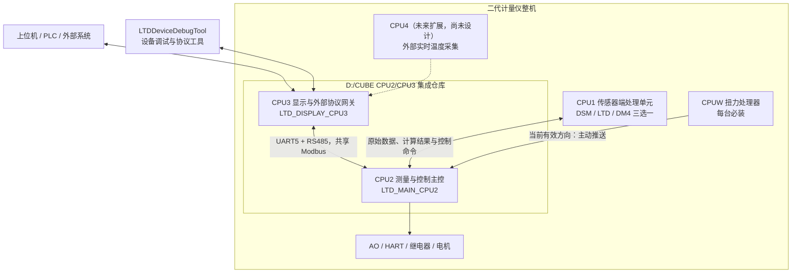

# CUBE

> CUBE 是二代计量仪的 CPU2/CPU3 集成仓库，直接维护主控固件、显示通信固件、两板共享协议、构建配置、版本记录和正式项目文档。完整的整机工程分布在多个 Git 仓库中，`D:\CUBE` 不是全部工程的集合。

## 整机关联工程（跨仓库）

以下项目共同组成当前已登记的二代计量仪整机工程。“库外”只表示不在 `D:\CUBE` 这个 Git 根目录中，不表示工程次要或可忽略。

| 工程 | Git 根或源码入口 | 整机职责 |
| --- | --- | --- |
| CUBE CPU2/CPU3 集成工程 | `D:\CUBE` | CPU2 测量与控制主控、CPU3 显示与外部协议网关，以及两板共享协议、构建、版本和正式项目文档 |
| DSM CPU1 SIL 工程 | `D:\keil_workspace\DSM_CPU1_SIL` | DSM CPU1 固件和对外通信协议的当前源码入口 |
| DSM 计量仪工程 | `D:\keil_workspace\DSM计量仪` | DSM CPU1、维护线工程、传感器端行为和历史 Modbus 协议来源 |
| CPUW 扭力处理器工程 | Git 根：`D:\CSS_workspace`；源码入口：`D:\CSS_workspace\newhall` | 每台设备必装的扭力采集与处理单元，主动向 CPU2 推送数据 |
| LTDDeviceDebugTool | `D:\CUBE_TOOLS\LTDDeviceDebugTool` | 面向本设备的上位机调试、参数操作、协议验证和测试支持工具 |

这些工程在产品关系上属于同一台设备，在 Git 和修改授权上仍保持独立边界：跨仓库修改时分别核对分支、HEAD 和工作区状态，并单独确认修改、提交与发布范围。当前尚未登记 LTD/DM4 CPU1 的独立源码仓库，也没有 CPU4 工程路径；不能根据历史目录名或 CPU 连续编号自行推断。

## 本仓库维护范围

| 工程 | 主要职责 |
| --- | --- |
| `LTD_MAIN_CPU2/` | 测量流程、运动控制、传感器接入、参数与 FRAM 持久化、故障处理、输出控制，以及 CPU2/CPU3 共享数据的权威实现 |
| `LTD_DISPLAY_CPU3/` | OLED 显示、菜单与按键、CPU2 数据轮询和参数同步，以及 DSM、Wärtsilä、LTD、LH、SI 等外部协议适配 |

## 整机一级架构



- CPU1 是传感器端处理单元，整机在 DSM、LTD、DM4 三种传感器中三选一；蓝牙主机和从机只作为透明传输链路，不作为独立 CPU。
- CPU2 是测量、运动、参数、故障和安全动作的业务权威端，并直接承担 AO/HART、继电器和电机控制。
- CPU3 负责显示、按键、CPU2 数据同步和全部外部数字协议网关。
- CPUW 是每台设备必装的扭力处理器；当前有效运行方向是 CPUW 主动向 CPU2 推送数据。
- CPU4 仅为未来非安全扩展预留，规划路径为“外部实时温度计 → CPU4 → CPU3 → 上位机”，当前没有实现工程。
- 只有采用 DM4 安全协议的配置才把 CPU1（DM4）与 CPU2 之间定义为安全通信链路；CPUW、CPU2/CPU3、CPU4 和 CPU3 对外接口不属于该链路。

涉及共享参数、测量结果、命令或故障语义的改动，需要同时核对 CPU2、CPU3、共享寄存器映射和协议版本。详细的处理器责任、安全边界和实现状态以[处理器与传感器架构确认基线](docs/06_SIL功能安全认证/02_软件架构/ER02软件架构设计编制工作包/02_编制依据与差异分析/处理器与传感器架构确认基线.md)为准。

## 仓库目录

### Git 中维护的主要内容

| 路径 | 用途 |
| --- | --- |
| `LTD_MAIN_CPU2/` | CPU2 STM32F429 固件工程 |
| `LTD_DISPLAY_CPU3/` | CPU3 STM32F429 固件工程 |
| `docs/` | 唯一正式项目文档源，包含构建、协议、需求、问题、测试、功能安全和硬件资料 |
| `cmake/` | CPU2/CPU3 共用的 Arm GNU 工具链配置 |
| `.github/workflows/` | CPU2/CPU3 持续集成构建配置 |
| `.agents/`、`AGENTS.md` | 本仓库的自动化协作和工程维护规则 |
| `CHANGELOG.md` | 固件版本改动记录 |

### 本机工作区内容

以下目录可能存在于开发机，但不作为 Git 业务资料维护：

| 路径 | 用途 |
| --- | --- |
| `build/LTD_MAIN_CPU2/`、`build/LTD_DISPLAY_CPU3/` | 两个固件工程的本地构建输出 |
| `tools/` | 本机构建、检查、文档预览和 Git 门禁工具 |
| `docs/00_程序流程导航/` | 本机生成并同步的程序流程导航 |
| `docs-site/` | 从 `docs/` 同步生成的本机文档预览站点 |
| `tmp/` | 可清理的任务临时产物 |
| `outputs/` | 需要在本机长期保留、但默认不提交的验证证据 |

## 库外参考文档

下列资料来自历史设计、协议、硬件和移植工作，全部位于 `D:\CUBE` 之外。地址是当前开发机于 2026-08-10 核对存在的本地绝对路径；换机或重新克隆后需要重新映射。它们是整机设计和追溯输入，不等同于当前实现；如有冲突，以用户最新确认、当前生产源码和已批准资料为准。

### 功能安全与文档模板

WPS 参考目录：`C:\Users\admin\WPSDrive\1204142814\WPS云盘\共享文件夹 \团队11.II代计量仪SIL认证\A00.I代认证资料\00.认证文档\`

| 资料 | 文件地址 | 历史用途 |
| --- | --- | --- |
| CG01 系统架构设计 | `C:\Users\admin\WPSDrive\1204142814\WPS云盘\共享文件夹 \团队11.II代计量仪SIL认证\A00.I代认证资料\00.认证文档\CG01.系统架构设计-V1.2.docx` | 整机系统架构、状态和安全边界的历史参考 |
| ER02 软件架构设计 | `C:\Users\admin\WPSDrive\1204142814\WPS云盘\共享文件夹 \团队11.II代计量仪SIL认证\A00.I代认证资料\00.认证文档\ER02.软件架构设计V1.1.docx` | 软件架构文档的结构、章节和版式参考 |
| FX01 软件详细设计 | `C:\Users\admin\WPSDrive\1204142814\WPS云盘\共享文件夹 \团队11.II代计量仪SIL认证\A00.I代认证资料\00.认证文档\FX01.软件详细设计V1.1.docx` | CPU2 软件详细设计的组织和版式参考 |
| GB 20438 资料包 | `C:\Users\admin\Downloads\GB20438.zip` | 功能安全标准资料参考 |

### 协议、硬件与平台资料

| 资料 | 文件地址 | 历史用途 |
| --- | --- | --- |
| DSM CPU1 对外通信协议 | `D:\keil_workspace\DSM_CPU1_SIL\docs\01_协议与接口\DSM_CPU1对外通信协议.md` | DSM CPU1 协议定义和 CUBE 适配依据 |
| 在线一体机对外 Modbus 协议 V1.228 | `D:\keil_workspace\DSM计量仪\docs\10_CPU2_主控\02_协议与参数\在线一体机对外Modbus协议V1.228.xlsx` | 一代设备和维护线 Modbus 历史基线 |
| DM4 电源板原理图 | `C:\Users\admin\Downloads\VMP多参数传感器，DM4四代数字驱动\DM4电源板V6.0.SchDoc` | DM4 电源板硬件分析原始文件 |
| DM4 驱动板原理图 | `C:\Users\admin\Downloads\VMP多参数传感器，DM4四代数字驱动\DM4驱动板V6.0.SchDoc` | DM4 驱动板硬件分析原始文件 |
| DM4 采集板原理图 | `C:\Users\admin\Downloads\VMP多参数传感器，DM4四代数字驱动\DM4采集板V6.0.SchDoc` | DM4 采集板硬件分析原始文件 |
| DM4 测水连接板原理图 | `C:\Users\admin\Downloads\VMP多参数传感器，DM4四代数字驱动\DM4测水连接板V6.0.SchDoc` | DM4 测水连接板硬件分析原始文件 |
| N81 操作手册 | `D:\程序存档\N81 - 操作手册.pdf` | 相关设备操作和接口行为参考 |
| STM32F4xx 到 GD32F4xx 移植指南 V2.0 | `C:\Users\admin\Downloads\从STM32F4xx系列移植到GD32F4xx系列_V2.0(2).pdf` | MCU 平台迁移和兼容性参考 |

## 快速构建

### 环境要求

- CMake 3.20 或更高版本
- Ninja
- Arm GNU Toolchain，并确保 `arm-none-eabi-gcc`、`arm-none-eabi-objcopy`、`arm-none-eabi-size` 等命令已加入 `PATH`

### CPU2

```bash
cmake -S LTD_MAIN_CPU2 -B build/LTD_MAIN_CPU2 -G Ninja -DCMAKE_TOOLCHAIN_FILE=cmake/toolchain-arm-none-eabi.cmake -DCMAKE_BUILD_TYPE=Debug
cmake --build build/LTD_MAIN_CPU2
```

### CPU3

```bash
cmake -S LTD_DISPLAY_CPU3 -B build/LTD_DISPLAY_CPU3 -G Ninja -DCMAKE_TOOLCHAIN_FILE=cmake/toolchain-arm-none-eabi.cmake -DCMAKE_BUILD_TYPE=Debug
cmake --build build/LTD_DISPLAY_CPU3
```

发布候选应使用全量清理构建：

```bash
cmake --build build/LTD_MAIN_CPU2 --clean-first
cmake --build build/LTD_DISPLAY_CPU3 --clean-first
```

构建目录会生成 `.elf`、`.hex`、`.bin` 和 `.map` 文件，其中还包括带固件版本号的 HEX。构建成功只能证明当前源码完成编译和链接，不能替代烧写、台架、硬件或现场验证。

更完整的环境、产物和发布前检查说明见：

- [CPU2 构建说明](docs/00_构建与版本/CPU2构建说明.md)
- [CPU3 构建说明](docs/00_构建与版本/CPU3构建说明.md)

## 代码入口

第一次阅读代码时，建议从以下入口开始：

| 目标 | CPU2 | CPU3 |
| --- | --- | --- |
| 启动与硬件初始化 | `LTD_MAIN_CPU2/Core/Src/main.c` | `LTD_DISPLAY_CPU3/Core/Src/main.c` |
| 应用初始化与主循环 | `LTD_MAIN_CPU2/Application/Src/app_main.c` | `LTD_DISPLAY_CPU3/Application/app_main.c` |
| 核心业务 | `LTD_MAIN_CPU2/Services/` | `LTD_DISPLAY_CPU3/Application/` |
| 通信实现 | `LTD_MAIN_CPU2/Services/Modbus/` | `LTD_DISPLAY_CPU3/Communication/` |

修改共享数据契约时，重点检查两端的 `system_parameter.h`、寄存器地址、结构体与寄存器之间的映射，以及 CPU3 的显示和外部协议消费点。

## 文档与版本入口

- [文档库入口](docs/README.md)：按构建、协议、需求、问题、测试、功能安全和硬件资料分类查找。
- [构建与版本文档](docs/00_构建与版本/README.md)：查看构建说明、版本总览、升级和版本测试资料。
- [协议与寄存器文档](docs/01_协议与寄存器/README.md)：查看 CPU2/CPU3 共享协议、外部协议和传感器协议。
- [CHANGELOG](CHANGELOG.md)：查看已发布或待发布的固件改动。

README 不固定抄录当前固件和协议版本，避免首页随版本演进失真。需要确认当前口径时，以以下来源为准：

- CPU2 固件版本：`LTD_MAIN_CPU2/Application/Inc/app_version.h`
- CPU3 固件版本：`LTD_DISPLAY_CPU3/Application/app_version.h`
- CPU2 共享协议定义：`LTD_MAIN_CPU2/Services/ParamStorage/system_parameter.h`
- CPU3 共享协议定义：`LTD_DISPLAY_CPU3/Application/system_param/system_parameter.h`
- 版本组合、兼容性和验证记录：`CHANGELOG.md` 与 `docs/00_构建与版本/版本改动与测试/`

## 开发约定

- 正式文档只维护在 `docs/`；`docs-site/` 只是本机预览层。
- 修改文件前确认编码和换行。部分历史固件源码使用 GBK/CP936，避免批量转码造成中文乱码。
- 共享协议、参数存储、故障码和显示语义变更必须核对通信两端及对应正式文档。
- 不要把构建或静态检查结果表述为真实硬件、通信、运动、输出或现场验证。
- 自动化执行和提交前门禁以 [AGENTS.md](AGENTS.md) 及仓库级 CUBE skill 为准。
