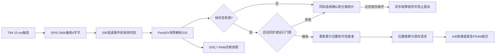

# CPU2 V1.40.0.0 / CPU3 V1.40.0.0 协议34编码器连续性保护与诊断改动与测试方案

## 1. 文档目的和适用范围

- 编制日期：2026-08-14。
- 适用固件：CPU2 `V1.40.0.0`、CPU3 `V1.40.0.0`。
- 共享协议：`DEVICE_PROTOCOL_VERSION = 34`。
- 提交状态：本文件随本次提交纳入，提交哈希以Git记录为准。
- 目标：发布本次对话形成的编码器采集、上电同步、运行连续性保护、故障处理、持久化协同和`ENC?`通信质量诊断；不把并行显示、液位、方法5、多参数V4或无效值资料改动纳入本提交。

本方案只记录源码、静态资料、工作簿和隔离候选树构建已经证明的内容。真实目标板、编码器、电机、FRAM、24 V掉电、OLED、RS485、现场和SIL结论单独列为未验证项。

## 2. 版本、协议和参数存储兼容性

| 项目 | 旧值 | 新值 | 兼容结论 |
| --- | --- | --- | --- |
| CPU2固件 | V1.39.2.0 | V1.40.0.0 | 新增编码器连续性保护与诊断，升MINOR |
| CPU3固件 | V1.39.0.0 | V1.40.0.0 | 同步协议34故障定义和显示，升MINOR |
| 共享协议 | 33 | 34 | 故障寄存器地址和宽度不变，新增12-17语义 |
| CPU2参数存储 | `DEVICE_PARAM_VERSION=3` | 保持3 | 结构、大小、CRC和FRAM布局不变 |
| CPU3参数存储 | `CPU3_PARAM_VERSION=0x0007` | 保持`0x0007` | 结构和FRAM布局不变 |

兼容规则：

- 协议34启用`12-6 ENCODER_POWERON_CHANGE`并新增`12-17 ENCODER_POSITION_JUMP`。
- `12-13 ENCODER_LINEARITY_WARNING`保留CPU2/CPU3定义和CPU3显示映射。当前`SSI_LINEARITY_FAULT_ENABLED=0`，LIN位只计数和显示，不拒绝位置帧、不锁存、不停车。
- 协议33的AO修正值已经采用x1000倍率，升级到协议34时原值保留；协议26～32继续按既有逻辑乘10迁移，协议25及更早或未知版本继续归零。
- `DeviceParameters`未新增字段，`struct_size`和CRC覆盖范围不变，升级不会触发恢复出厂或清除现场参数。
- 编码轮周长为0会使位置换算和动态门限失去分母。旧存储加载时归一化为既有出厂值`95000`（0.001 mm，即95.000 mm）；主站写入候选值0时返回FC10非法数据值，不污染运行态或FRAM。
- CPU2与CPU3继续要求共享协议版本严格相等；协议33一侧不能解释12-17，现场必须成对升级到协议34组合。

## 3. 本次提交范围

### 3.1 CPU2源码

- `LTD_MAIN_CPU2/BSP/Peripherals/inc/AS5145.h`
- `LTD_MAIN_CPU2/BSP/Peripherals/src/AS5145.c`
- `LTD_MAIN_CPU2/Services/Encoder/encoder.h`
- `LTD_MAIN_CPU2/Services/Encoder/encoder.c`
- `LTD_MAIN_CPU2/Application/Src/app_main.c`
- `LTD_MAIN_CPU2/Application/Src/fault_recovery.c`
- `LTD_MAIN_CPU2/Application/Src/serial_command.c`
- `LTD_MAIN_CPU2/Services/Modbus/hostcommu_modbus.c`
- `LTD_MAIN_CPU2/Services/MotorControl/motor_ctrl.h`
- `LTD_MAIN_CPU2/Services/MotorControl/motor_ctrl_driver_param.c`
- `LTD_MAIN_CPU2/Services/MotorControl/motor_ctrl_position_model.c`
- `LTD_MAIN_CPU2/Services/ParamStorage/system_parameter.c`
- `LTD_MAIN_CPU2/Services/ParamStorage/system_parameter.h`
- `LTD_MAIN_CPU2/Services/Sensor/sensor.c`
- `LTD_MAIN_CPU2/Services/Utilities/error_log.c`
- `LTD_MAIN_CPU2/Application/Inc/app_version.h`

### 3.2 CPU3源码

- `LTD_DISPLAY_CPU3/Application/display/display.c`
- `LTD_DISPLAY_CPU3/Application/system_param/system_parameter.h`
- `LTD_DISPLAY_CPU3/Application/app_version.h`

### 3.3 版本、协议和正式资料

- `CHANGELOG.md`
- `docs/00_构建与版本/故障码/LTD故障代码统一表.xlsx`
- `docs/00_构建与版本/故障码/当前程序故障代码清单.md`
- `docs/01_协议与寄存器/CPU2_CPU3协议变更记录.md`
- `docs/03_问题分析与整改/未处理/2026-08-14_CPU2编码器采集_连续性保护与持久化当前实现说明.md`
- `docs/03_问题分析与整改/未处理/README.md`
- 本测试方案。

`tools/`、`outputs/`、`tmp/`和`docs/00_程序流程导航/`属于本机验证或导航层，不进入Git提交。

## 4. 详细改动点

### 4.1 有界SSI事件队列与主循环解耦

- 源码位置：`AS5145.c`的`SSI_EnqueueEvent`、`AS5145_ProcessDeferred`、`AS5145_HasDeferredWork`；调用链为`TIM/SPI/DMA ISR -> 固定队列 -> PendSV -> SSI_ProcessFrame`。
- 改前问题：采样异常、完整帧、队列溢出和业务解析证据不足，主循环阻塞期间难以判断帧是否被接收、排队或处理；持久化也可能与待处理SSI竞争PendSV时间。
- 具体改法：保持10 ms定时触发和SPI5 DMA接收；ISR只复制4字节原始帧、HAL错误、采样时刻和序号。8项环形队列满时累计溢出证据；单次PendSV最多处理4项，仍有积压时重新挂起。普通FRAM保存发现SSI积压时先退让。
- 必查边界：队列空/满、连续传输失败、完整帧入队但未处理、序号跨流程边界、主循环长时间阻塞、PendSV反复挂起。
- 通过标准：ISR路径不出现打印、FRAM或阻塞等待；每轮最多处理4项；积压最终继续调度；`ENC?`中的帧、传输失败和溢出计数能区分接收与处理问题。

### 4.2 SSI帧解析、同码连续确认与LIN诊断策略

- 源码位置：`AS5145.c`的`Parse_SSI_Data`、`Check_SSI_Error_Condition`、`SSI_ProcessError`、`SSI_ProcessFrame`和`AS5145DiagnosticSnapshot`。
- 改前问题：不同错误类型可能被合并成“连续3次”，现场无法区分奇偶校验、OCF、COF、LIN、断线和队列溢出；持续LIN会直接阻断启动和测量。
- 具体改法：断线特征、传输、奇偶校验、OCF、COF、LIN、运行跳变和其它错误分别累计；只有同一错误码连续3次才锁存普通SSI故障，正常或同步帧打断未锁存计数。LIN每帧统计并保留原始位，当前产品宏关闭其故障入口。
- 必查边界：三种不同错误交替、同码第2/第3帧、好帧打断、全0/全1、校验错与LIN同时出现、故障锁存后好帧恢复。
- 通过标准：交替错误不组成连续3次；同码第3次才锁存；LIN持续为1时`lin_count`增加但位置仍可接受且`12-13`不锁存。

### 4.3 上电首次同步和12-6锁存

- 源码位置：`encoder.c`的`EncoderSynchronizeAngleSample`、`Encoder_WaitAngleSynchronized`、`Encoder_BeginNewProcess`；`AS5145.c`的`SSI_ProcessError`。
- 改前问题：刚启动首帧可能直接参与累计，FRAM保存角与当前角突变缺少可靠确认；启动过程可能先暴露通用首帧超时而隐藏具体故障。
- 具体改法：连续3帧确认启动角，相邻角差不超过16 counts；冷启动稳定后与FRAM保存角按单圈最短路径比较。差值不超过320 counts时一次补入累计，超过320 counts时立即撤销`position_valid`并锁存12-6。等待接口优先返回已锁存具体故障。
- 必查边界：第1/2/3帧、16/17 counts、319/320/321 counts、跨0点、A/B记录无效、等待期间发生具体错误、回零与普通命令。
- 通过标准：前两帧不开放运动；稳定第3帧后才同步；321 counts触发12-6且累计不接纳；只有正式回零或零点标定能解除上电跳变禁用并重建零点。

### 4.4 20 m/min动态物理上限和12-17

- 源码位置：`encoder.c`的`EncoderWrapDelta`、`EncoderRuntimeDeltaLimit`、`EncoderProcessRuntimeSample`和`EncoderRecordRejectedSample`。
- 改前问题：固定门限无法同时覆盖不同周长和采样间隔，单圈异常跳变可能被误解释为真实多圈位移并推高液位，甚至超过罐高。
- 具体改法：按`20,000 mm/min × 4096 counts/rev × dt × 125% / (60 × circumference)`向上取整，再加8 counts；结果限制在半圈。候选绝对增量超过动态上限时拒绝，不更新累计或可信单圈角；编码轮模式下同码连续3次锁存12-17。
- 必查边界：周长95.0 mm和107.9 mm、dt=1/10/50 ms、正反方向、跨0点、等于/大于上限、周长为0、半圈钳位。
- 通过标准：合法20 m/min边界含余量可接纳；超过上限的样本不改变`g_encoder_count`；`ENC?`显示候选、上限、间隔和拒绝原因；第3个连续12-17证据锁存并硬停。

### 4.5 超过50 ms断档只产生一次旧基准异常

- 源码位置：`encoder.c`的`EncoderProcessRuntimeSample`。
- 改前问题：一次采样断档持续沿用旧时间和角度基准时，后续帧可能被放大为连续3次超时并误锁存。
- 具体改法：`dt>50 ms`时拒绝当前候选、不补算断档位移，同时把当前单圈角和采样时刻设为新基准并撤销累计位置可信度。后续帧按新基准计算，不再重复使用断档前时刻。
- 必查边界：dt=50/51 ms、断档期间静止/同向/反向/跨圈、编码轮模式、电机记步模式、断档后连续正常帧。
- 通过标准：同一断档只形成一次旧基准超时证据；下一帧间隔从新时刻计算；断档后`position_valid=0`，软件不声称恢复不可观测的多圈位移。

### 4.6 故障锁存、异步硬停和位置源差异

- 源码位置：`AS5145.c`的`SSI_ProcessError`，`app_main.c`和`motor_ctrl_position_model.c`的显式编码器故障集合，`motor_ctrl_driver_param.c`的运动门禁，`sensor.c`的锁存错误消费。
- 改前问题：依赖主循环轮询或枚举数值范围会漏掉非连续新增错误码；单帧瞬态可能过早停止业务；电机记步模式可能被后台编码器异常错误阻断。
- 具体改法：通过`Encoder_IsRuntimeFaultCode`显式列举运行类错误；编码轮模式锁存后由异步故障管理器发布错误并立即禁止驱动，业务只读取已锁存错误；电机记步模式清除后台运行类错误但保留统计。切回编码轮前同时检查锁存、同步和累计位置可信。
- 必查边界：主循环阻塞、单帧瞬态、第3帧锁存、电机/编码轮模式、锁存后新正式命令、切换位置源、周长标定确定性错误。
- 通过标准：主循环阻塞时仍先硬停；单帧不被业务消费；电机记步不被后台12类运行故障阻断；不可信位置无法切回编码轮。

### 4.7 方向不一致只作统计

- 源码位置：`encoder.c`的`EncoderProcessRuntimeSample`和`EncoderDebugSnapshot`。
- 改前问题：电机方向状态与编码增量符号可能因安装方向、状态更新时间或机械回差短暂不一致，直接拒绝会增加误停风险。
- 具体改法：超过16 counts且符号与当前上/下行状态不一致时只增加`direction_mismatch_count`；仍按动态物理上限决定是否接纳位置。
- 必查边界：上下行、停止、正反安装、16/17 counts、动态上限以内/以外。
- 通过标准：方向不一致计数增加但本身不拒绝样本、不锁存、不停车；超动态上限仍按12-17处理。

### 4.8 ENC?一致快照和通信质量统计

- 源码位置：`AS5145_GetDiagnosticSnapshot`、`Encoder_GetDebugSnapshot`和`SerialCommand_PrintEncoderStatus`。
- 改前问题：原`ENC?`只显示累计与保存值，无法判断未就绪来自SPI链路、断线帧、解析校验、队列溢出、启动同步还是动态门限拒绝。
- 具体改法：临界区复制RAM快照，输出编码累计/同步/候选、SSI原始帧/解析位/分类计数，以及链路、校验、处理三项质量。统计范围明确为本次上电；查询路径不触发SPI或FRAM。
- 必查边界：尚无帧、计数为0、计数饱和、断线数超过帧数的防御钳位、并发更新、LIN持续置位、队列溢出。
- 通过标准：零分母输出0.000%；无传输/断线/校验/溢出时三项为100.000%；LIN和方向不一致不混入通信质量；三行字段与同一快照一致。

### 4.9 编码轮周长零值防护

- 源码位置：`system_parameter.c`的`normalize_device_params_runtime`，`hostcommu_modbus.c`的`EncoderCircumferenceCandidateIsValid`。
- 改前问题：周长0会导致位置换算和动态增量门限分母无效，可能关闭保护或产生错误位置。
- 具体改法：启动归一化把旧存储零值恢复为95.000 mm；FC10候选镜像含零周长时返回非法数据值并恢复寄存器镜像。
- 必查边界：旧FRAM为0、写0、写1、部分覆盖周长高低字、其它FC10参数同时写入。
- 通过标准：启动后运行态周长非0；写0不进入运行态和持久化；合法非0值仍按原流程写入。

### 4.10 A/B位置记录、普通保存和24 V紧急保存协同

- 源码位置：`encoder.c`的V2记录读选、`Encoder_ProcessDeferredPersistence`、掉电回执和紧急结果邮箱；`motor_ctrl.h`中的硬停接口声明。
- 改前问题：普通保存、SSI积压和紧急掉电提交可能竞争PendSV/FRAM；保存失败若每10 ms立即重试会长期占用低优先级处理；上电仅凭一份不完整回执不能证明掉电保存成功。
- 具体改法：V2记录使用A/B槽、代次、提交标记和CRC选新；普通保存先避让SSI积压，失败后50 ms退避；紧急保存取得FRAM紧急所有权，先作废旧回执、提交位置、再提交独立回执并有界重试。主循环只打印PendSV发布的完成快照。
- 必查边界：A/B单槽损坏、同代/代次回绕、提交标记未完成、CRC错、普通写失败、紧急请求插入、回执各阶段掉电、软件测试与真实掉电复位。
- 通过标准：只选择完整且CRC正确的新记录；普通失败不每周期占用PendSV；紧急流程不会被普通写插入；非掉电复位不伪报真实掉电成功。

### 4.11 共享故障、CPU3显示和正式资料同步

- 源码位置：CPU2/CPU3 `system_parameter.h`、CPU2 `error_log.c`、CPU3 `display.c`、`fault_recovery.c`以及协议和故障码资料。
- 改前问题：12-6/12-13仍被标为保留，缺少12-17，双端协议和现场故障口径不一致；自动恢复可能重跑无法证明位置可信的流程。
- 具体改法：双端协议升级34并增加12-17相同数值；12-6和12-17加入不可自动恢复集合；12-13保留定义但当前不产生。同步CPU2错误名称/原因、CPU3中文显示、Markdown清单、协议记录和工作簿。
- 必查边界：CPU2/CPU3协议不匹配、12-6/12-13/12-17显示、未知故障、自动恢复入口、工作簿使用中/保留状态。
- 通过标准：双端枚举值一致；协议34资料只宣称12-6和12-17为使用中；12-13显示映射存在但当前不由程序主动产生；不可恢复集合不自动重跑12-6/12-17。

## 5. 跨模块数据流和异常闭环

闭环约束：

- 状态位正常不代表位置必然接纳；仍需通过启动同步或运行动态门限。
- 被拒绝的候选不更新累计位置；超过50 ms断档只推进未知位移后的新时间/角度基准，并撤销位置可信度。
- 业务停止只消费锁存故障，避免单帧瞬态过早终止测量。
- 新正式流程可以清运行故障并重同步单圈角，但不补故障期间位移；12-6只能由回零或零点标定重新建立累计基准。

## 6. 测试环境和准备条件

- CPU2/CPU3源码以本次最终候选提交树为准。
- 编译环境使用仓库CMake/Ninja和ARM GCC工具链，分别执行CPU2、CPU3 clean-first构建。
- 台架建议准备：可控AS5145/SSI帧注入器或逻辑分析仪、可双向运行到20 m/min的电机机构、95.0 mm和107.9 mm两种周长参数、FRAM掉电注入、可控24 V电源、CPU3 OLED和RS485上位机。
- 每个运动用例开始前记录`ENC?`三行、位置源、累计位置、FRAM代次和故障状态；结束后再次记录并保存串口原始日志。

## 7. 可执行测试矩阵

| 用例 | 关联改动 | 前置条件 | 输入/操作步骤 | 观测位置 | 预期结果与通过标准 | 状态/证据 |
| --- | --- | --- | --- | --- | --- | --- |
| ENC-01 | 4.1、4.2 | 编码轮模式，正常SSI | 连续采集1000帧 | `ENC?`、逻辑分析仪 | 帧计数增长；无传输失败/断线/校验/溢出；三项质量100.000% | 未执行，需目标板 |
| ENC-02 | 4.2 | 可注入奇偶校验错 | 错2帧、好1帧、再错2帧 | 锁存码、连续数 | 不锁存；好帧打断连续计数 | 未执行，需故障注入 |
| ENC-03 | 4.2 | 可注入同一错误 | 连续注入3帧奇偶校验错 | CPU2错误、驱动使能 | 第1/2帧只诊断，第3帧锁存对应错误并禁止驱动 | 未执行，需故障注入 |
| ENC-04 | 4.2、4.11 | LIN可控 | LIN持续1且其它位正常 | `ENC?`、CPU2/CPU3故障 | LIN计数增长；位置继续接纳；12-13不锁存、不停车 | 未执行，需真实编码器/注入 |
| ENC-05 | 4.3 | FRAM记录有效，机构静止 | 上电发送3帧，相邻差16 counts | 同步、稳定帧数 | 第3帧完成同步，位置有效 | 未执行，需目标板 |
| ENC-06 | 4.3 | FRAM记录有效 | 上电稳定角与保存角差321 counts | 12-6、位置有效、运动门禁 | 立即锁存12-6，位置无效，普通命令不能运动 | 未执行，需目标板 |
| ENC-07 | 4.3 | 已锁存12-6 | 分别执行普通命令、正式回零 | 锁存、同步、FRAM记录 | 普通命令不重建；回零成功后可信零点重新保存 | 未执行，需电机台架 |
| ENC-08 | 4.4 | 周长107.9 mm，dt约10 ms | 逐步增加单帧增量至上限±1 | 候选、上限、累计 | 等于上限接纳；大于上限拒绝且累计不变 | 未执行，需帧注入 |
| ENC-09 | 4.4、4.6 | 编码轮模式 | 连续3个超动态上限候选 | 12-17、驱动使能 | 第3个12-17证据锁存并硬停 | 未执行，需运动/注入 |
| ENC-10 | 4.5 | 正常同步后 | 制造51 ms断档，再恢复10 ms帧 | 间隔、超时计数、连续数 | 旧基准只产生一次超时；下一帧按新基准；位置可信撤销 | 未执行，需时序注入 |
| ENC-11 | 4.7 | 可控制电机状态 | 在动态上限内制造方向符号不一致 | 方向不一致、拒绝原因 | 计数增加，拒绝原因保持0，位置接纳且不停车 | 未执行，需运动/注入 |
| ENC-12 | 4.6 | 电机记步模式 | 注入编码器运行异常 | 电机运行、`ENC?` | 后台统计增加，编码器运行故障不阻断电机位置源 | 未执行，需台架 |
| ENC-13 | 4.6 | 电机记步且编码位置不可信 | 请求切回编码轮 | 返回码、位置源 | 返回具体编码器错误或位置不可用，位置源不切换 | 未执行，需台架 |
| ENC-14 | 4.8 | 尚未收到任何帧 | 上电立即执行`ENC?` | 三行输出 | 零分母不异常，质量为0.000%，字段格式完整 | 未执行，需串口台架 |
| ENC-15 | 4.9 | 参数周长有效 | FC10写周长0 | Modbus响应、运行参数 | 返回非法数据值；旧值保持 | 未执行，需RS485 |
| ENC-16 | 4.9 | FRAM周长为0 | 重启 | 参数全量打印 | 周长归一化为95.000 mm且后续门限非0 | 未执行，需FRAM注入 |
| ENC-17 | 4.10 | A/B槽可改写 | 分别破坏A、B、提交标志和CRC | 启动日志、活动槽 | 选择最新完整记录；双槽无效时保持不可信并只允许回零 | 未执行，需FRAM注入 |
| ENC-18 | 4.10 | 可控24 V掉电 | 在回执各写入阶段随机断电 | 上电回执判定、23-6 | 只有记录与回执完整一致才报告成功；真实掉电不完整时升级23-6 | 未执行，需掉电台架 |
| ENC-19 | 4.11 | CPU2/CPU3 V1.40.0.0 | 触发12-6和12-17 | CPU3 OLED | 显示正确中文故障；12-13仅在人工注入错误码时可显示 | 未执行，需双板联调 |

## 8. 复杂场景分步验证

### 8.1 主循环阻塞期间的连续异常硬停

1. 烧写CPU2 V1.40.0.0并选择编码轮记步。
2. 让电机以可观测低速运行，确认`ENC?`同步=1、位置有效=1、故障锁存=0。
3. 用调试路径让主循环进入超过100 ms的可控阻塞，但保持TIM、SPI DMA和PendSV可运行。
4. 在阻塞期间连续注入3个相同的校验错误或3个超动态上限候选。
5. 用逻辑分析仪同时观测第3个异常帧、驱动使能脚和串口恢复后的错误状态。
6. 通过标准：第3个异常达到确认条件后，不等待主循环恢复即禁止驱动；恢复后错误码与注入类型一致，累计位置不包含被拒绝候选。

### 8.2 50 ms断档与后续恢复

1. 正常采集至少10帧并记录当前角、累计位置和最后正常时刻。
2. 停止SSI完成事件51～80 ms，期间分别让机构静止和移动。
3. 恢复第一帧，记录`间隔`、`拒绝原因`、`超时`、`连续数`和位置有效。
4. 10 ms后再发送一帧小增量正常帧。
5. 通过标准：恢复第一帧记录一次采样断档并撤销位置可信；第二帧使用新的10 ms基准，不再次继承51～80 ms旧间隔；软件不补算断档期间多圈位移。

### 8.3 真实24 V掉电保存窗口

1. 建立有效A/B记录并运动到未保存差值大于0的位置。
2. 记录当前代次、活动槽、累计值和独立回执内容。
3. 分别在“回执作废前、A/B提交中、记录完成回执未提交、回执提交后”切断24 V。
4. 每种阶段至少重复20次，重启后保存完整启动日志与`ENC?`。
5. 通过标准：任何不完整阶段都不被宣布为掉电保存成功；真实掉电复位且回执不完整/不一致时产生23-6；完整提交时恢复的累计、单圈角、代次和回执一致。

## 9. 回归范围

- 编码轮记步下的回零、零点标定、普通测量、液位跟随、探底和位置源切换。
- 电机记步下的运动门禁、后台编码器诊断、切回编码轮失败路径和人工位置修正。
- CPU2启动参数加载、协议33到34迁移、AO x1000修正保持、FC10其它参数写入。
- AS5145正常帧、全0/全1、奇偶校验、OCF、COF、LIN、SPI启动/接收失败和队列溢出。
- 编码器A/B保存、普通256 counts触发、FRAM写失败退避、软件`PWRTEST`和真实掉电回执。
- CPU2错误日志、故障自动恢复排除、CPU3 OLED 12类故障显示以及CPU2/CPU3协议不匹配提示。
- `ENC?`原有累计、保存值、代次、活动槽和掉电判定字段不得回归；新增三行不得在查询时访问外设。

## 10. 已执行验证

### 10.1 隔离候选树

- 候选树对象：`280a74808e2fa7375b9d3437f7e4120321fc39de`。
- 源码路径：`tmp/encoder-conversation-release-20260814/candidate-src-v1`。
- `display.c`采用真实index blob `6c4ae7cc220ca053d8adc02a12191b55bef89714`，避免混入并行OLED改动。
- `motor_ctrl.h`采用真实index blob `93acec1a0761da701123a6564ad57770416713b2`，避免混入并行方法5改动。
- 构建后仅有CPU3协议注释调整为“LIN保留诊断映射”，不改变预处理结果或固件行为；其余候选源码与最终目标内容一致。

### 10.2 CPU2 clean-first构建

- 命令：`cmake --build build/LTD_MAIN_CPU2 --clean-first`，输入为上述隔离候选树。
- 结果：通过，`text=341460`、`data=2352`、`bss=59296`。
- 固定名和版本名HEX SHA-256：`4687B817108C6BF398E2FAF22DF54A7DA2881CCE1DF58972389A422AF4D5C272`。
- 证据：`tmp/encoder-conversation-release-20260814/validation-cpu2-build.json`。

### 10.3 CPU3 clean-first构建

- 命令：`cmake --build build/LTD_DISPLAY_CPU3 --clean-first`，输入为上述隔离候选树。
- 结果：通过，`text=220720`、`data=20996`、`bss=100764`。
- 固定名和版本名HEX SHA-256：`121926EB7A6780D20DB4699BB2D2F997C95A127AAFA16242FC4563C2A1D2A6D8`。
- 证据：`tmp/encoder-conversation-release-20260814/validation-cpu3-build.json`。

### 10.4 故障码工作簿

- 最终工作簿：`docs/00_构建与版本/故障码/LTD故障代码统一表.xlsx`。
- SHA-256：`DE110B17F509F05D6E02DB34032365BE2FFBF55B91D3FAC93142D77FB8E531A3`。
- 9个工作表完成结构和视觉检查；`文档简介!A2`、`文档简介!B7`和`协议34新增故障!D3`复核通过；公式错误扫描无匹配。
- 证据：`tmp/encoder-conversation-release-20260814/validation-workbook-render.json`和`outputs/encoder-conversation-release-20260814/LTD故障代码统一表.xlsx`。

上述证据证明候选源码可以编译链接、故障码工作簿结构和指定单元格符合当前资料口径；不证明目标板时序、真实机械速度、编码器信号质量、FRAM掉电窗口、OLED或现场行为。

### 10.5 静态、编码和文档门禁

- 已通过隔离临时index的`git diff --cached --check`和scoped范围检查，目标文件为26个；`display.c`和`motor_ctrl.h`继续使用任务开始时真实暂存层blob，未混入后续并行改动。
- 已通过固件版本、故障码目录契约、CPU3故障原因显示、Markdown链接、程序流程HTML契约和流程反向索引检查。
- 编码检查覆盖25个文本文件：16个CP936、8个UTF-8、1个保持既有UTF-8 BOM的`CHANGELOG.md`；未发现解码失败、U+FFFD、BOM状态意外变化、两个英文问号或新增`//`注释。
- `check_docs_structure.py`未通过，失败项均位于本机忽略的`docs/00_程序流程导航/`：流程页仍引用并行分支`4b2106d2`中的`measurement_validity.c/.h`、`device_params_validation.c/.h`和未进入当前工作树的参数候选校验方案。该失败不来自26文件提交候选；为避免覆盖并行流程资料，本任务不修改或提交这些本机页面。

## 11. 风险与未验证项

- 未执行真实AS5145坏帧、持续LIN、磁场强弱、偏心和气隙验证；LIN长期置位对测量精度的影响仍未知。
- 未执行20 m/min双向连续运动、95.0/107.9 mm周长边界和动态门限临界值验证；25%与8 counts属于软件保护余量，不替代机械实测。
- 未执行超过50 ms断档期间跨圈运动验证；单圈编码器无法唯一恢复断档期间多圈位移，当前策略明确撤销位置可信度。
- 未测量从第3个异常帧到驱动使能关闭的真实时延；主循环解耦由调用链和构建证明，实时上限仍需逻辑分析仪。
- 未执行FRAM各阶段随机掉电、代次回绕、普通写失败退避和24 V保持窗口压力测试。
- 未执行CPU3 OLED、CPU2/CPU3 RS485、现场长期运行或SIL验证。
- 12-17锁存后新流程只能重建单圈角基准，不能补故障期间位移；若异常来自真实机构位移而非电气毛刺，必须回零或人工校正后再信任编码轮累计位置。

## 12. 提交前检查清单

- [x] CPU2版本头为V1.40.0.0，CPU3版本头为V1.40.0.0。
- [x] CPU2/CPU3 `DEVICE_PROTOCOL_VERSION`均为34。
- [x] CPU2 `DEVICE_PARAM_VERSION`保持3；CPU3 `CPU3_PARAM_VERSION`保持`0x0007`；参数结构未变化。
- [x] CHANGELOG补齐版本、兼容性、修改、验证和未验证风险。
- [x] 协议变更记录、故障码清单、工作簿和当前实现说明同步12-6/12-13/12-17口径。
- [x] CPU2、CPU3隔离候选源码执行clean-first构建并记录产物哈希。
- [x] 工作簿完成9个工作表视觉检查和公式错误扫描。
- [x] 最终临时index与本文件列出的提交路径逐项一致。
- [x] 运行编码、替换字符、C块注释、Markdown、协议、故障码、版本、scope和`git diff --check`门禁；文档结构检查的本机并行流程残留已在10.5节单独记录。
- [ ] 提交后核对完整四段式正文、提交树、剩余并行改动和根目录Compare。

程序流程影响：本次改变SSI事件处理、启动同步、运行门限、故障出口、位置源切换和诊断输出，属于流程变化；对应本机流程导航应按最终候选源码同步，但`docs/00_程序流程导航/`和相关`tools/`按仓库规则不进入Git提交。
