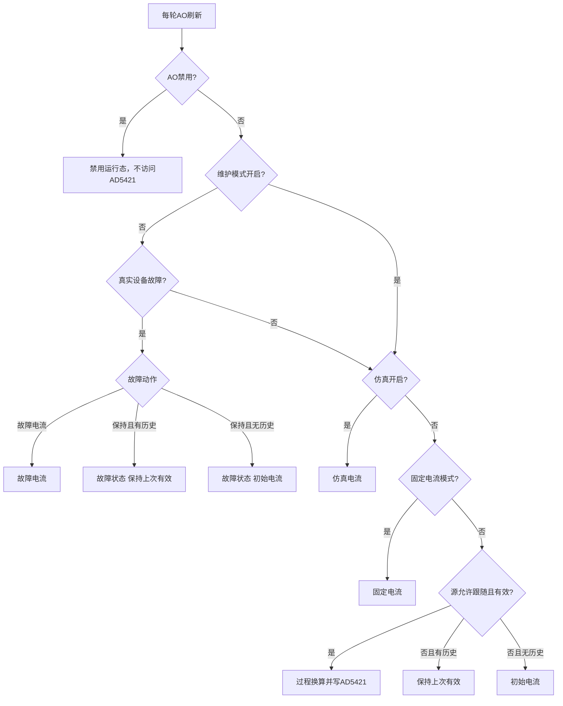

# 4-20mA 电流输出逻辑

更新日期：2026-08-03

## 1. 文档目的

本文定义 CUBE 当前 4-20mA/AO 输出的权威业务逻辑，覆盖过程源、基础目标与修正后目标、初始/过程/保持/故障状态、维护模式故障电流屏蔽、上次有效缓存、阻尼、AD5421 写入、CPU2/CPU3 运行态、参数兼容性和台架测试。

源码入口：

- CPU2状态机：`LTD_MAIN_CPU2/Services/AoOutput/ao_output.c`
- CPU2配置和共享结构：`LTD_MAIN_CPU2/Services/ParamStorage/system_parameter.h`
- CPU3参数和共享结构：`LTD_DISPLAY_CPU3/Application/system_param/system_parameter.h`
- CPU3菜单与运行页：`LTD_DISPLAY_CPU3/Application/display/display_tankopera.c`

本文以共享协议27建立的AO正式行为为功能基线，首个正式固件组合为CPU2 V1.31.0.0 / CPU3 V1.30.0.0。本次组合为共享协议33、CPU2 V1.39.0.0 / CPU3 V1.38.0.0；协议32首个组合为双端V1.37.0.0。协议33保持基础AO配置x100，把电流修正、最终目标和最近实发值提升为x1000。

## 2. 核心术语

| 术语 | 定义 |
| --- | --- |
| 初始电流 | `power_on_current_mA_x100`字段保存的配置值。字段名和寄存器地址为兼容历史不变，协议24业务名称为“初始电流” |
| 基础目标电流 | 输出来源完成选择和既有模式限幅后、尚未叠加`current_correction_mA_x1000`的目标；基础配置和缓存仍为x100 |
| 修正后目标电流 | AO启用时的基础目标电流加电流修正值，并经过3.20~24.00mA物理限幅；禁用来源不修正 |
| 有效过程目标 | 有效过程输入经过阻尼、量程换算和模式限幅形成基础目标，修正后已经成功写入AD5421的目标 |
| 上次有效 | 最近一次成功写入AD5421的有效过程基础目标，以及同轮阻尼后输入值和比例 |
| 保持 | 没有新的可用过程目标，但RAM中已有上次有效缓存时，继续输出缓存电流 |
| 真实设备故障 | `device_state == STATE_ERROR`，且错误码既不是`NO_ERROR`也不是`STATE_SWITCH` |
| 维护模式 | 非持久化叠加状态；只屏蔽真实设备故障触发的故障电流分支，不屏蔽初始、过程、保持、仿真、固定、电流修正或AD5421自身诊断 |
| 驱动错误 | AD5421初始化、SPI访问、诊断或写电流失败；它表示输出驱动不可确认，不等同于整机过程故障动作 |

## 3. 三种过程源

过程源枚举和寄存器数值固定如下，单位均为0.1mm，CPU3按mm显示：

| 数值 | 过程源 | 数据来源 | 有效条件 | 命令门禁 |
| --- | --- | --- | --- | --- |
| 0 | 储罐液位 | 液位流程通过`AoOutput_PublishProcessSample()`发布的样本 | 液位样本有效 | 仅`STATE_FLOWOIL`，当前命令为寻找液位、标定液位或修正液位，且没有待切换命令 |
| 1 | 传感器位置 | `g_measurement.debug_data.sensor_position`权威运行值 | 编码轮记步时`Encoder_IsReady()`为真；电机记步时`MotorCtrl_IsDriverInitValid()`为真 | 不受当前命令和待切换命令限制，位置源就绪后持续跟随 |
| 2 | 水位 | 水位流程通过`AoOutput_PublishProcessSample()`发布的样本 | 水位样本有效 | 仅`STATE_FOLLOW_WATERING`，当前命令为水位跟随或水位标定，且没有待切换命令 |

传感器位置的`0.0mm`是允许的有效值。不能使用历史的`UNVALID_POSITION == 0`判断AO位置无效，必须使用当前记步源的就绪状态。

## 4. 输出优先级

AO目标选择使用固定优先级：

1. AO禁用：不初始化、诊断或写入AD5421；运行态保留3.40mA名义目标，但最近实发电流为0且CPU3显示`N/A`。
2. 非维护状态下的真实设备故障：按故障动作输出故障电流或保持上次有效过程电流。
3. 输出仿真：输出配置的仿真电流。
4. 固定电流模式：输出配置的固定电流。
5. 普通过程输出：按所选过程源进入初始、过程或保持状态。
6. 修正与物理限幅：除禁用来源外，在选出的基础目标上统一叠加一次电流修正值，再限制到3.20~24.00mA。

因此，非维护状态下设备进入真实故障后，即使仿真开关仍为开，也必须先执行故障动作。维护模式开启时跳过这一设备故障分支，继续按仿真、固定或普通过程链选择目标。AO禁用时先于上述分支直接返回，不访问AD5421。AO启用后，AD5421驱动自身失败由更底层的初始化、诊断和写入链路报告为“驱动错误”，维护模式不屏蔽该诊断，此时软件无法承诺物理环路已经达到任何目标电流。

## 5. 普通过程状态

### 5.1 初始状态

满足以下任一情况且没有上次有效缓存时进入初始状态：

- 上电后尚未获得首个有效过程目标。
- 液位或水位尚未进入匹配跟随状态。
- 传感器位置的当前记步源尚未就绪。
- 过程样本无效。
- 配置变化已经清除缓存，但新过程目标尚未成功写入AD5421。

初始状态输出配置的初始电流。初始电流成功写入AD5421也不能建立“上次有效过程”缓存，因为它不是由有效过程输入换算得到的目标。

### 5.2 过程状态

过程状态必须同时满足：

- AO工作模式已启用。
- 没有真实设备故障。
- 仿真未开启。
- 电流模式不是固定电流。
- 所选过程源满足本源的跟随条件和有效条件。

原始过程值先经过一阶阻尼，再按0%和100%量程换算：

`percent_x100 = (value - range_0) * 10000 / (range_100 - range_0)`

`base_current_mA_x100 = 400 + percent_x100 * 1600 / 10000`

对应工程公式为：`过程基础电流 = 4.00mA + 百分比 × 16.00mA`。

量程允许反向配置，但0%值和100%值不得相等。过程电流按电流模式限幅：

| 电流模式 | 过程电流下限 | 过程电流上限 |
| --- | ---: | ---: |
| NE | 3.80mA | 20.50mA |
| US | 3.90mA | 20.80mA |
| 普通 | 4.00mA | 20.50mA |
| 固定电流 | 不执行过程换算 | 不执行过程换算 |

过程模式边界限制的是基础电流。AO启用时所有来源随后统一执行：

`corrected_current_mA_x1000 = base_current_mA_x100 * 10 + current_correction_mA_x1000`

修正值默认0.000mA，原始范围-1000~+1000，对应-1.000~+1.000mA。初始、过程、固定、仿真、故障电流和保持均使用这一步；禁用态只保留3.400mA软件名义目标，不叠加修正，也不写入AD5421。修正后目标最终限制到AD5421物理范围3.200~24.000mA。

### 5.3 保持状态

已有上次有效缓存后，以下非故障场景进入保持状态：

- 液位有效后切换到其它命令。
- 水位有效后切换到其它命令。
- 液位或水位重新搜索，新的有效样本尚未形成。
- 液位、水位或传感器位置样本暂时失效。
- 自动恢复重新执行液位或水位流程，但新过程值尚未出现。
- 传感器位置的编码器或电机驱动暂时不具备就绪条件。

保持状态继续使用上次成功过程的基础电流，并在运行态中同时发布该电流对应的缓存输入值和比例。本轮再对缓存基础电流叠加一次当前修正值；缓存本身不保存修正后电流，因此不会在周期刷新或故障保持中累计叠加。保持状态不会回退初始电流，也不会使用当前无效样本重新换算。

## 6. 上次有效缓存

缓存位于CPU2 RAM，内容包括：

- 上次成功过程基础电流，单位0.01mA。
- 同轮阻尼后过程输入，单位0.1mm。
- 同轮过程比例，单位0.01%。
- 有效标志。

缓存更新必须同时满足：

1. 本轮来源是正常过程状态。
2. 过程输入有效并完成阻尼和量程换算。
3. `AD5421_SetCurrentX1000()`实际执行。
4. AD5421返回`NO_ERROR`。

目标只在软件中计算完成、尚未写入、写入失败、驱动恢复失败、初始电流写入成功、固定/仿真/故障电流写入成功，均不得更新过程缓存。

以下变化清除缓存并重置阻尼：

- AO工作模式切到禁用。
- AO输出源变化。
- AO电流模式变化。
- 0%或100%量程端点变化。
- 当前选择传感器位置源时，罐高变化。
- 当前选择传感器位置源时，记步方式在编码轮和电机之间变化。

阻尼系数变化只重置阻尼，不单独清除上次有效缓存。缓存不写入FRAM，掉电或CPU2复位后必须重新从初始状态建立。

## 7. 阻尼行为

一阶阻尼只作用于正常过程输入：

`filtered += (raw - filtered) * dt / (tau + dt)`

其中`tau = damping_x10_s * 100ms`。初始、固定、仿真、禁用和输出故障电流不经过过程阻尼。

保持期间不输入无效的新样本，同时把滤波时间基准更新到当前时刻，使滤波值和阻尼时间均被冻结。恢复有效过程输入后，从保持前的滤波值继续变化，不把保持持续时间一次性计入`dt`。

采用“保持上次有效”故障动作且已有缓存时，同样冻结阻尼；输出故障电流或故障保持无历史时重置阻尼。

## 8. 故障逻辑

### 8.1 故障电流动作

当设备处于非维护状态、满足真实故障条件且`fault_mode=0`时，AO进入故障状态并输出`fault_current_mA_x100`。配置范围为3.40~22.60mA，旁路过程阻尼。

### 8.2 保持上次有效动作

当设备处于非维护状态且`fault_mode=1`时：

- 有上次有效缓存：AO运行态为故障，输出缓存电流，同时发布缓存输入值和比例。
- 无上次有效缓存：AO运行态仍为故障，但输出初始电流，输入值和比例无效。

故障动作不会清除上次有效缓存。故障恢复后，如果匹配过程的新值尚未形成，普通流程继续进入保持状态；新有效目标成功写入AD5421后才替换缓存。

### 8.3 维护模式

维护模式开启时，即使设备状态和错误码满足真实故障条件，也不进入AO故障电流动作。AO继续按仿真、固定、过程、保持或初始链输出，并继续统一叠加一次电流修正。维护模式不关闭AO、不清除过程缓存，也不屏蔽AD5421初始化、SPI、诊断或写入错误。

### 8.4 警告、切换和取消

警告、命令切换、取消或样本无效本身不属于真实设备故障，不得输出故障电流。它们按“有缓存则保持、无缓存则初始”的普通过程规则处理。

## 9. AD5421写入与驱动错误

AO目标变化时立即尝试写入；目标不变时至少每1000ms刷新一次。相同目标写失败后按刷新周期重试，避免高速重复访问。

写入成功后：

- 更新`last_sent_mA_x1000`和`last_sent_tick`。
- 如果本轮是过程状态，再更新上次有效缓存。
- 清除或排队报告驱动恢复状态。

写入失败或AD5421诊断失败后：

- 运行态来源改为驱动错误。
- 保留最近一次成功下发电流，不能把失败目标发布为已输出。
- 不更新上次有效过程缓存。
- 由驱动恢复逻辑按节流周期尝试恢复最近成功下发目标；仍失败时继续报告驱动错误。

`last_sent_mA_x1000`只是最近一次成功下发给AD5421的命令值，不是DAC回读，也不是物理4-20mA环路的电流表实测值。

## 10. CPU2/CPU3运行态

`AoOutputRuntime.source`定义如下：

| 数值 | 状态 | 目标来源 | `process_valid` |
| ---: | --- | --- | --- |
| 0 | 初始 | 初始电流 | 0 |
| 1 | 过程 | 当前有效过程输入 | 1 |
| 2 | 故障 | 故障电流、缓存电流或无历史时的初始电流 | 采用保持且有历史时为1，否则为0 |
| 3 | 仿真 | 仿真电流 | 0 |
| 4 | 固定 | 固定电流 | 0 |
| 5 | 禁用 | 3.40mA软件名义目标，不访问AD5421 | 0 |
| 6 | 驱动错误 | 当前目标不可确认 | 不作为CPU3过程数据显示依据 |
| 7 | 保持 | 上次有效过程缓存 | 1 |

CPU3 AO运行页共4行：

1. 输出状态：显示`AO:初始`、`AO:过程`、`AO:保持`、`AO:故障`、`AO:模拟`、`AO:固定`、`AO:禁用`、`AO:驱动故障`或`AO:N/A`。
2. 输入值：过程、保持或采用保持动作且有历史的故障状态显示mm；其它状态显示`N/A`。
3. 输入比例：与输入值使用同一缓存代次；无有效过程快照时显示`N/A`。
4. 输出电流：显示最近一次成功下发电流；禁用、CPU2通信不可用或尚无成功下发记录时显示`N/A`。

## 11. 参数、寄存器和存储兼容性

协议33继续保持原AO地址、字段顺序和结构尺寸：

- `output_source`地址不变，值1由“空高”改为“传感器位置”。
- `power_on_current_mA_x100`字段名和地址不变，业务名称由“非跟随电流”改为“初始电流”。
- AO运行态结构不增加字段，只为`source`增加值7并重新解释值0。
- AO第4个32位槽沿用原位置并改名为有符号`current_correction_mA_x1000`，单位0.001mA、范围-1000~1000、默认0；后续地址不移动。
- `DEVICE_PARAM_VERSION`保持3，`DeviceParameters`大小、字段偏移、元信息和CRC范围不变，不因协议26自动恢复出厂。

兼容风险：协议25及更早版本把第4个AO槽视为隐藏预留，升级时CPU2强制把修正值归零；协议26～32的合法x100旧值在协议33加载时乘10迁移。协议27只重排共享地址，不新增第二个修正值；协议33的结构尺寸、CRC和`DEVICE_PARAM_VERSION=3`均不变。CPU2/CPU3必须严格同为协议33，协议32与33参数快照不得跨版本恢复。

## 12. 可执行测试矩阵

| 用例 | 前置条件 | 操作 | 观察点 | 通过标准 | 当前状态 |
| --- | --- | --- | --- | --- | --- |
| AO-01 液位首次有效 | 源0，缓存为空，普通/NE/US模式 | 上电后先搜索，再形成有效液位 | CPU3状态、输入值、AD5421命令、电流表 | 首次有效前为初始；成功写入后为过程且电流对应液位 | 未台架 |
| AO-02 液位命令切换 | 完成AO-01 | 切换到密度、罐底或其它命令 | 状态、输入值、输出电流 | 状态变保持，电流、输入值和比例保持不变 | 未台架 |
| AO-03 液位重新搜索 | 已有液位缓存 | 重新执行液位寻找并暂时失效样本 | 状态、阻尼、输出电流 | 新有效值前持续保持；新值出现后从保持滤波值继续 | 未台架 |
| AO-04 传感器位置编码轮 | 源1，编码轮模式 | 编码器未就绪后变为就绪，移动传感器并经过0.0mm | 就绪标志、位置、状态、电流 | 未就绪且无历史为初始；就绪后持续过程；0.0mm有效；命令切换不停止跟随 | 未台架 |
| AO-05 传感器位置电机记步 | 源1，电机记步模式 | 驱动未初始化后初始化，移动并切换命令 | 驱动有效标志、位置、输出 | 驱动有效后持续跟随；命令切换不停止；驱动暂时失效后保持 | 未台架 |
| AO-06 水位首次有效和切换 | 源2，缓存为空 | 水位跟随形成有效样本后切换命令 | 状态、过程值、电流 | 首次有效前初始；有效后过程；切换后保持 | 未台架 |
| AO-07 故障电流优先 | 维护关闭，已启用仿真，故障动作0 | 置真实设备故障 | 状态、仿真标志、输出 | 状态为故障，输出故障电流而非仿真电流 | 未台架 |
| AO-08 故障保持有历史 | 已建立任一源缓存，故障动作1 | 置真实设备故障并恢复 | 状态、输入值、比例、电流 | 故障期间保持缓存；恢复后新值前进入普通保持，不回初始 | 未台架 |
| AO-09 故障保持无历史 | 上电缓存为空，故障动作1 | 在首次过程成功前置故障 | 状态和电流 | 状态为故障，输出初始电流，输入值和比例为N/A | 未台架 |
| AO-10 缓存清除 | 已建立缓存 | 分别禁用、切源、切电流模式、改量程；位置源另改罐高和记步方式 | 状态和电流 | 缓存被清除，重新启用或配置稳定后先进入初始，直到新过程目标成功写入 | 未台架 |
| AO-11 AD5421写失败 | 已建立缓存，可注入SPI/写失败 | 改变过程值触发新目标并注入失败 | 驱动错误、last_sent、缓存 | 状态为驱动错误；last_sent和上次有效缓存均不被失败目标覆盖 | 未台架 |
| AO-12 阻尼冻结 | 阻尼非0，已建立缓存 | 使样本失效保持一段时间后恢复为阶跃值 | 输入值和输出曲线 | 保持期间数值不变；恢复首步不把整段保持时间计入dt | 未台架 |
| AO-13 反向量程和边界 | 配置100%值小于0%值 | 输入0%、50%、100%及超量程值 | 百分比、电流 | 反向映射正确，电流按NE/US/普通模式边界限幅 | 未台架 |
| AO-14 正负电流修正 | AO启用，修正值先后设为-1000、-1、0、1、1000 | 分别覆盖初始、过程、固定、仿真和故障电流 | 基础目标、AD5421命令、输出电流 | 可分辨±0.001mA；各来源按基础目标加一次修正，边界±1.000mA且不重复叠加 | 未台架 |
| AO-15 保持不重复修正 | 已建立过程缓存，修正值非0 | 切换命令进入保持并持续刷新，再进入故障保持 | 基础缓存、连续AD5421命令 | 每轮输出始终为缓存基础电流加一次修正，不随刷新次数累加 | 未台架 |
| AO-16 禁用旁路修正与硬件门禁 | 修正值设为+1000或-1000，电流环开路 | 上电保持禁用，并从启用模式切换到禁用 | SPI抓包、CPU2 AO运行态、CPU3运行页 | 不产生AD5421初始化、诊断或写入命令；名义目标始终为3.400mA，最近实发为0，CPU3输出电流显示`N/A` | 未台架 |
| AO-17 CPU2/CPU3协议门禁 | 准备协议32/33交叉固件 | 交叉烧写后上电 | CPU3协议提示、写门禁 | 明确显示协议不匹配，不开放普通写；协议33双端配套后按x1000解释AO修正和运行态 | 未台架 |
| AO-18 维护模式屏蔽故障电流 | 已建立过程缓存，故障动作0，维护关闭 | 置真实设备故障，记录故障电流；再开启维护并分别切换过程、固定和仿真 | 维护状态、AO来源、AD5421命令、电流表 | 维护开启后不再输出设备故障电流，过程/固定/仿真及单一修正链仍有效；注入AD5421故障仍报告驱动错误 | 未台架 |

## 13. 回归范围与残余风险

回归范围包括AO参数FC10整体校验、源切换默认量程、仿真开关上电清零、维护模式设备故障电流屏蔽、HART电流和百分比读取、AD5421诊断恢复、CPU3四行菜单、协议严格相等门禁、液位/水位样本发布和位置记步模式切换。

自动静态检查和双端构建只能证明符号、共享定义和编译链一致，不能证明禁用态真实SPI静默、物理环路精度、断环电流、AD5421故障脚行为、阻尼曲线或真实电机/编码器时序。上述项目必须使用CPU2/CPU3实机、逻辑分析仪、可注入故障的AD5421测试环境和校准电流表完成台架验收。
