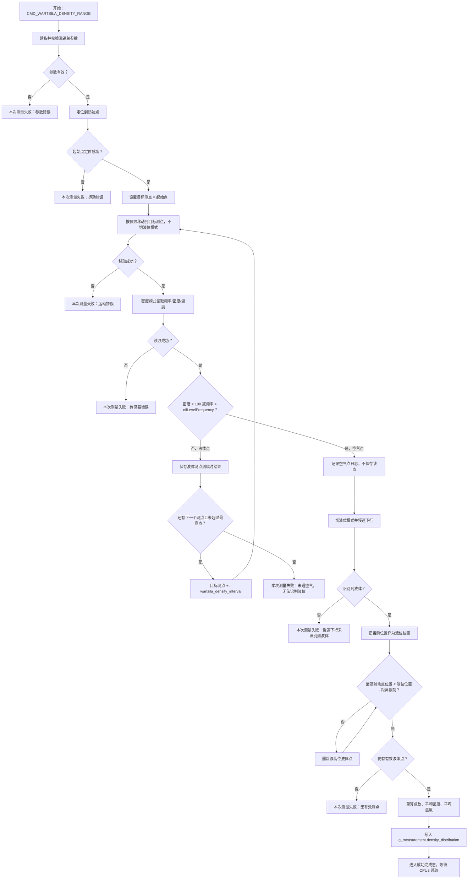

# 瓦锡兰分布测量点间移动与慢速下行识别液位优化需求方案

日期：2026-06-11

状态：已按本方案落地 CPU2 代码，待现场硬件联调验证。

## 背景

当前瓦锡兰分布测量在从一个测点向下一个测点移动时，会切换到液位模式，并在上行过程中判断是否进入空气。该方式能在运动中及时发现液面，但也带来频繁模式切换、运动过程液位判定和密度采集流程耦合的问题。

新的方案希望把“点间移动”和“液体/空气判定”拆开：

- 点间移动阶段只负责按位置运行到下一个测点。
- 到达测点后，再用密度模式下读到的密度值和频率值判断当前点在液体还是空气。
- 一旦测点为空气，再切换液位模式并慢速下行；识别到在液体中后，把当前位置作为液位位置。
- 根据识别到的液位位置重新裁剪高位测点，只有位置小于“液位位置 - 距离限制”的测点作为有效点。

## 目标

1. 瓦锡兰分布测量从一个点到下一个点的过程中，不切换液位模式，不在运动过程中做液位模式空气检测。
2. 到达测点后，通过密度模式读取的密度值和频率值判断当前测点是液体还是空气。
3. 当前点为液体时，保存该点并继续运行到下一个点。
4. 当前点为空气时，该空气点不进入最终结果；记录日志后切换液位模式并慢速下行识别液体。
5. 识别到液体后，把当前位置作为液位位置；只有位置小于“液位位置 - 距离限制”的已保存液体点保留为有效点。
6. 慢速下行未识别到液体、裁剪后无有效点或关键读取失败时，本次瓦锡兰分布测量失败，不更新新的有效结果，不按成功完成态对外暴露。

## 已实现范围和未改内容

- 已在 CPU2 `wartsila_density_measurement.c` 落地瓦锡兰专用点间移动、到点空气判定、空气点后慢速下行识别液体和有效点裁剪。
- 已在 CPU2 `measure.c` 调整瓦锡兰分布测失败处理，失败时不把临时结果覆盖为新的有效结果。
- 不修改 CPU2/CPU3 共享结构体、寄存器地址或外部 Wartsila 寄存器映射。
- 不改普通分布测量、国标分布测量、密度每米测量、普通区间测量和固定点监测的行为。
- 本轮提交阶段已升级 CPU2 到 `V1.13.1.0`，并同步 `CHANGELOG.md` 和版本改动与测试方案。

## 影响范围

| 模块 | 影响 |
| --- | --- |
| CPU2 `wartsila_density_measurement.c` | 已重构瓦锡兰专用测点循环、点间移动、空气点判定、慢速下行识别液体和结果裁剪。 |
| CPU2 `measure_density.c` | 建议不改变通用 `SinglePoint_ReadSensor()` 语义；如需复用稳定读取逻辑，应新增瓦锡兰专用采点封装。 |
| CPU2 传感器读取 | 已通过瓦锡兰专用采点读取密度、频率、温度三项值，用于结果保存和空气判定。 |
| CPU2 结果处理 | 测量失败时不应把清零临时结果覆盖为新的有效分布结果。 |
| CPU3 / 外部 Wartsila | 本方案不改变寄存器映射；外部读取结果的点数和点数据仍来自 `density_distribution`。 |

## 新测量流程

## 程序流程图



### 1. 参数快照

瓦锡兰测量开始时仍使用现有参数：

| 参数 | 含义 | 单位 |
| --- | --- | --- |
| `wartsila_lower_density_limit` | 起始点 / 最低测点高度 | mm |
| `wartsila_upper_density_limit` | 最高测点高度 | mm |
| `wartsila_density_interval` | 点间距 | mm |
| `wartsila_max_height_above_surface` | 有效测点距识别液位的最小允许距离 | mm |
| `oilLevelFrequency` | 固定频率液位阈值，用于空气判定 | Hz |

基础校验沿用现有口径：

- 点间距不能为 0。
- 最高点必须大于起始点。
- 理论点数超过 `MAX_MEASUREMENT_POINTS` 时裁剪到上限。

### 2. 移动到起始点

起始点定位仍需要先把传感器移动到 `wartsila_lower_density_limit` 附近。

起始点定位同步改为只按位置移动，不做运动中液位检测，不因液位阈值提前停止。实现中保留目标位置检查、错误返回和命令切换处理。

### 3. 点间移动

从当前测点运行到下一个测点时：

1. 不切换液位模式。
2. 不调用运动中液位状态检测。
3. 不因为运动过程中频率达到液位阈值而提前停止。
4. 直接按目标位置调用位置运行函数，到达下一个测点。
5. 运动过程仍必须保留电机错误、驱动状态、碰撞、命令切换等安全检查。

建议目标函数语义：

```c
// 已实现：仅按位置移动到瓦锡兰目标测点，不做液位模式空气检测。
static uint32_t Wartsila_MoveToDensityPoint(float target_mm);
```

### 4. 到点采集和空气判定

到达目标测点后，进入瓦锡兰专用采点逻辑：

1. 读取密度模式下的频率、密度和温度。
2. 根据密度和频率判断当前点是液体还是空气。
3. 液体点保存到临时 `DensityDistribution`。
4. 空气点不保存到最终结果，仅记录日志。

空气判定规则：

| 条件 | 口径 | 判定 |
| --- | --- | --- |
| `density < 100` | 实际密度值，不使用 RAW 值 | 空气 |
| `frequency > g_deviceParams.oilLevelFrequency` | 本次读取得到的浮点频率，不使用 `debug_data.frequency` 整数值 | 空气 |
| 密度读取 5 分钟超时后输出 `density == 0` | 按实际密度值兜底输出 | 空气 |
| 不满足以上条件 | 实际密度值和浮点频率均未触发空气条件 | 液体 |

说明：

- 只要任一空气条件成立，就停止继续向上布点。
- 空气点不进入 `single_density_data[]`，也不计入 `measurement_points`。
- 空气点需要记录日志：点序号、目标位置、实际位置、密度、频率、触发原因。

建议新增瓦锡兰专用采点结果：

```c
typedef struct {
    DensityMeasurement measurement;
    float frequency_hz;
    float density_value;
    float temperature_c;
    float actual_position_mm;
    bool is_air;
    const char *air_reason;
} WartsilaPointSample;
```

该结构只作为 CPU2 内部实现建议，不进入 CPU2/CPU3 共享协议。

### 5. 空气点后的慢速下行识别液位函数

当某个测点判定为空气后，流程切换液位模式并调用慢速下行识别液体函数。

已实现函数契约：

```c
// 已实现：瓦锡兰空气点后慢速下行识别液体函数。
// 输入：当前空气点位置、测量上下文。
// 输出：识别到液体时的当前位置 level_mm。
// 行为：切换液位模式，从空气点慢速下行；识别到液体后停止，并把当前位置作为液位。
static uint32_t Wartsila_MoveDownToLiquidAfterAirPoint(float air_point_mm,
                                                       float *level_mm);
```

约束：

- 该函数负责切换液位模式、慢速下行、液体识别、盲区保护、碰撞检查、丢步检测、驱动状态检查和命令切换处理。
- 慢速下行过程中若单段运动结束仍未识别到液体，会继续补发下行运动，直到识别到液体、到达下限、超时或发生错误。
- 返回 `NO_ERROR` 时，`level_mm` 必须是识别到液体时的当前位置，单位 mm，并作为本次液位位置使用。
- 返回错误时，本次瓦锡兰分布测量失败。
- 如果执行过程中发生命令切换，应返回 `STATE_SWITCH` 并由上层正常退出。

### 6. 根据识别液位裁剪测点

识别到液体后，根据识别到的液位位置裁剪已保存的液体点。

裁剪规则：

1. 空气点本身不在结果里，因此不需要再删除。
2. 从最高已保存液体点开始向下检查。
3. 先计算有效点位置边界：

   ```text
   valid_limit_mm = level_mm - wartsila_max_height_above_surface
   ```

4. 只有 `point.position_mm < valid_limit_mm` 的液体点作为有效点保留。
5. 如果 `point.position_mm >= valid_limit_mm`，说明该点距离液面太近或正好压在边界上，删除该点。
6. 继续向下检查，直到遇到第一个满足 `position_mm < valid_limit_mm` 的点。
7. 不设置“最多删除两个点”的硬限制；两个点只是典型情况：空气点不保存，最高液体点可能因过近被删除。
8. 删除后重新计算点数、平均密度和平均温度。
9. 如果裁剪后没有有效液体点，本次测量失败。

### 7. 结果写入和完成态

只有满足以下条件时，才把临时结果写入 `g_measurement.density_distribution` 并进入成功完成态：

- 至少有 1 个有效液体测点。
- 已识别到液体并取得液位位置。
- 高位点裁剪完成。
- 平均值重算完成。
- 测量过程没有未恢复错误。

失败场景下：

- 不把清零临时结果覆盖为新的有效结果。
- 不进入 `STATE_WARTSILA_DENSITY_OVER` 的成功结果语义。
- 保留错误码，便于 CPU3/外部侧判断当前测量未成功。

## 推荐实现方向

推荐新增瓦锡兰专用采点函数，而不是修改通用 `SinglePoint_ReadSensor()`。

理由：

- 空气判定是瓦锡兰新流程专用语义，不应影响普通单点、固定点监测和其他分布测量。
- `Read_Density()` 已能返回频率、密度、温度，瓦锡兰专用函数可以直接保留本次频率用于判定和日志。
- 不需要修改 `DensityMeasurement`，避免改变 CPU2/CPU3 共享结果结构和外部寄存器语义。
- 后续测试范围更容易收敛到瓦锡兰路径。

建议拆分：

| 函数 | 责任 |
| --- | --- |
| `Wartsila_MoveToDensityPoint()` | 只移动到目标点，不切液位模式，不做液位空气检测。 |
| `Wartsila_ReadPointAndClassify()` | 读取密度/频率/温度，输出液体或空气判定。 |
| `Wartsila_MoveDownToLiquidAfterAirPoint()` | 已实现，空气点后切液位模式并慢速下行，识别到液体后返回当前位置。 |
| `Wartsila_TrimPointsByOilLevel()` | 按识别液位和最小液面距离裁剪高位点并重算统计。 |

## 错误处理口径

| 场景 | 处理 |
| --- | --- |
| 参数非法 | 返回参数错误，本次测量失败。 |
| 点间移动失败 | 返回运动错误，本次测量失败。 |
| 到点读取传感器失败 | 返回传感器错误，本次测量失败。 |
| 到点判定为空气 | 不保存空气点，切液位模式并慢速下行识别液体。 |
| 慢速下行未识别到液体 | 本次测量失败，不更新新的有效结果。 |
| 裁剪后无有效液体点 | 本次测量失败。 |
| 命令切换 | 返回 `STATE_SWITCH`，按正常中断退出。 |

## 协议和版本影响评估

本轮已改变 CPU2 固件行为，提交阶段已升级 CPU2 到 `V1.13.1.0`。

- CPU2 固件版本：`V1.13.0.1 -> V1.13.1.0`。
- 如果不改 CPU2/CPU3 共享命令、寄存器、结构体、参数语义和 CPU3 消费方式，预计不需要升级 `DEVICE_PROTOCOL_VERSION`。
- 失败时不优化 CPU3 外部 Wartsila 主站状态码表达；按现有错误/非成功完成语义处理，因此本方案不因失败状态表达调整 CPU3 外部协议。
- 如果新增可配置阈值而不是复用 `oilLevelFrequency`，则会涉及参数/菜单/寄存器影响，需要重新评估协议和参数存储版本。
- 版本改动与测试方案见 `../../00_构建与版本/版本改动与测试/2026-06-11_CPU2_V1.13.1.0_瓦锡兰分布测量点间移动与空气点液位识别_改动与测试方案.md`。

## 已执行本地验证

本轮已完成以下本地验证，记录见 `../../05_测试记录/2026-06-11_瓦锡兰分布测量点间移动与慢速下行识别液体优化验证记录.md`：

1. `py -B tools\check_wartsila_distribution_logic.py`：检查关键实现规则。
2. `cmake --build build\LTD_MAIN_CPU2`：确认 CPU2 工程可构建。
3. `git diff --check`：检查补丁空白问题。

尚未完成现场硬件联调、CPU3 页面读取验证和外部 Wartsila 主站读取验证；这些项目仍作为发布前验证项保留。

## 验收标准

实现完成后，至少需要验证：

1. 起始点定位和后续点间移动过程中，都不切换液位模式，不因液位阈值提前停止。
2. 液体点实际密度值和浮点频率均在有效范围内时，点被保存。
3. 实际密度值 `< 100` 时，当前点按空气处理且不保存。
4. 浮点频率 `> oilLevelFrequency` 时，当前点按空气处理且不保存。
5. 密度读取 5 分钟超时输出 0 时，当前点按空气处理。
6. 空气点后切液位模式并慢速下行；未识别到液体时本次测量失败，不更新新的有效结果。
7. 识别到液体后，把当前位置作为液位位置；只有 `point.position_mm < level_mm - wartsila_max_height_above_surface` 的点保留为有效点。
8. 裁剪后平均温度、平均密度和点数重新计算。
9. 裁剪后无有效点时，本次测量失败。
10. 普通单点、固定点监测、普通分布测量、国标分布测量、密度每米测量行为不变。

## 已确认口径

- 慢速下行识别液体函数已落地：使用慢速下行、液位模式运动中判定、当前位置作为液位，并保留安全保护。
- 起始点定位同步改为不做运动中液位检测。
- 空气判定中密度 `< 100` 使用实际密度值，不使用 RAW 值。
- 频率比较使用本次读取得到的浮点频率，不使用写入 `debug_data.frequency` 后的整数频率。
- 失败时不需要同步优化 CPU3 外部 Wartsila 主站的状态码表达。
