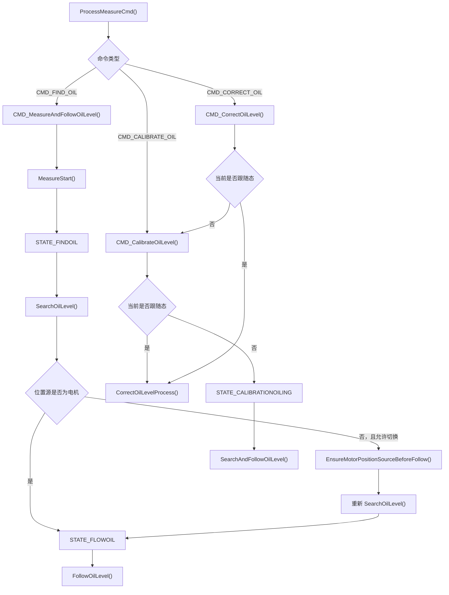
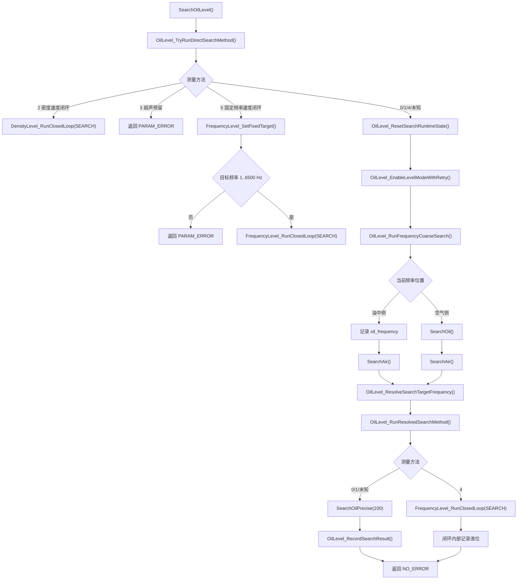
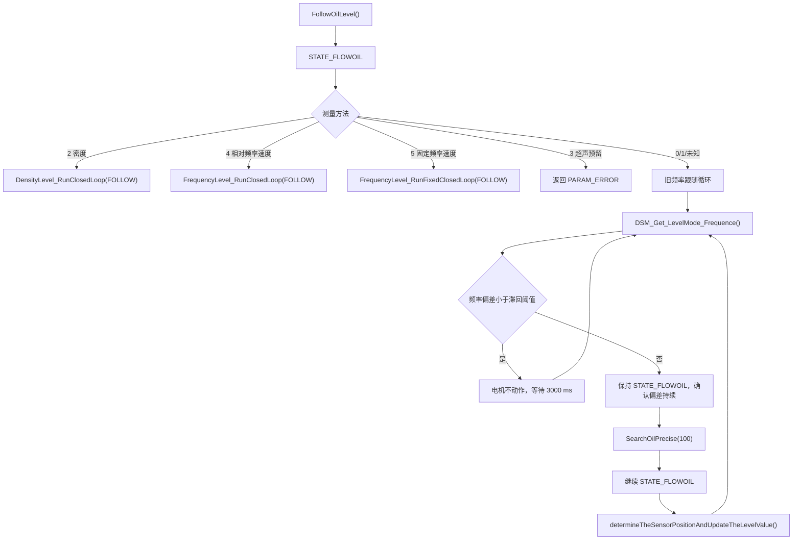
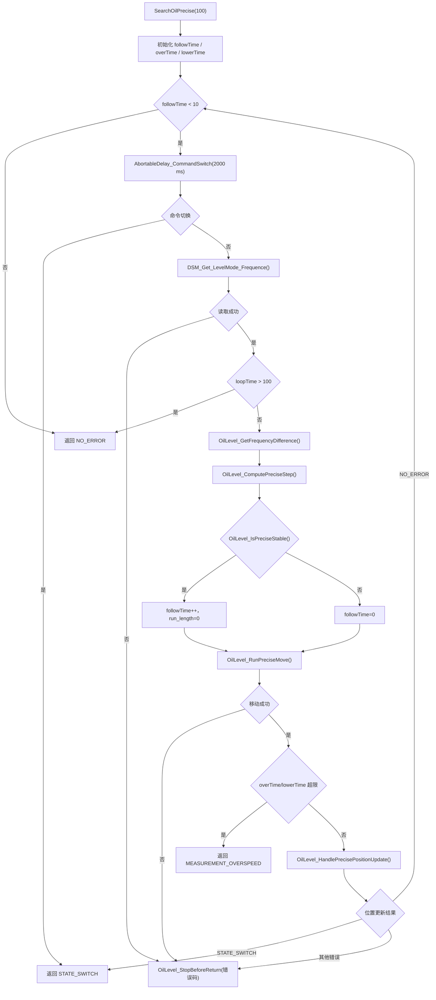
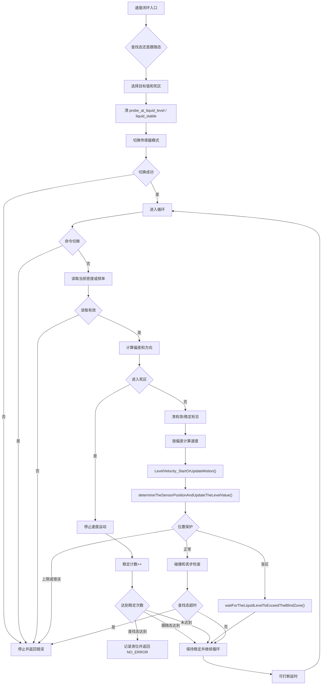

# CPU2 液位找液位与跟随软件详细设计

日期：2026-07-06

适用范围：`LTD_MAIN_CPU2/Application/Src/measure_oilLevel.c`、`LTD_MAIN_CPU2/Application/Inc/measure_oilLevel.h`、`LTD_MAIN_CPU2/Application/Src/measure.c` 中的油品液位找液位、液位跟随、液位修正相关流程。

关联流程文档：[CPU2 找液位详细流程梳理](2026-06-11_CPU2找液位详细流程梳理.html)、[CPU2 液位测量与跟随统一程序流程](../00_程序流程导航/CPU2/04_液位测量与跟随.html)。

## 1. 设计目标

液位模块负责在 CPU2 上完成油品液位识别、液位跟随、液位修正和结果发布。当前设计目标如下：

- 支持多种液位测量方法，并明确区分步进运动和速度闭环运动。
- 方法 `0/1` 保留原离散步进精找逻辑，不复用速度闭环。
- 方法 `2/4/5` 使用速度模式闭环，减少频繁启停。
- 方法 `5` 为固定频率速度闭环，不粗找空气/油中端点。
- 液位结果统一写入 `g_measurement.oil_measurement` 和 `g_measurement.density_distribution.Density_oil_level`。
- 边界、盲区、命令切换、传感器错误、电机错误都必须及时退出，避免测量状态机带故障继续运行。
- AO 输出由 `OilLevel_UpdateAoOutput()` 在液位结果变化后触发刷新。

## 2. 模块边界

| 层级 | 文件/函数 | 职责 |
| --- | --- | --- |
| 命令入口 | `measure.c` / `ProcessMeasureCmd()` | 正式测量命令分发，`CMD_FIND_OIL` 进入液位测量。 |
| 液位命令处理 | `CMD_MeasureAndFollowOilLevel()`、`CMD_CalibrateOilLevel()`、`CMD_CorrectOilLevel()` | 执行找液位、跟随、标定和修正入口逻辑。 |
| 液位调度 | `SearchOilLevel()`、`FollowOilLevel()`、`SearchAndFollowOilLevel()` | 依据测量方法选择粗找、步进精找、密度闭环或频率闭环。 |
| 粗找端点 | `SearchOil()`、`SearchAir()`、`OilLevel_RunFrequencyCoarseSearch()` | 查找空气/油中端点频率，供方法 `0/1/4` 使用。 |
| 步进精找 | `SearchOilPrecise()` 及其 helper | 方法 `0/1` 的离散步进定位。 |
| 速度闭环 | `DensityLevel_RunClosedLoop()`、`FrequencyLevel_RunClosedLoop()`、`FrequencyLevel_RunFixedClosedLoop()` | 方法 `2/4/5` 的速度模式查找和跟随。 |
| 结果与保护 | `determineTheSensorPositionAndUpdateTheLevelValue()`、`OilLevel_PublishFollowPosition()`、`OilLevel_CheckPositionLimit()` | 更新液位、发布状态、检查罐高上限和盲区下限。 |

## 3. 测量方法设计

| 方法 | 名称 | 找液位路径 | 跟随路径 | 关键差异 |
| --- | --- | --- | --- | --- |
| `0` | 相对频率步进法 | 粗找空气/油中端点，目标频率取端点中点，进入 `SearchOilPrecise(100)`。 | 旧循环读频率，偏差超滞回后再次步进精找。 | 离散步进，不使用速度闭环。 |
| `1` | 固定频率步进法 | 仍先粗找端点，目标频率取 `oilLevelFrequency`，进入 `SearchOilPrecise(100)`。 | 同方法 `0` 的旧循环。 | 固定目标频率，但运动仍是步进。 |
| `2` | 密度速度闭环 | 直接进入 `DensityLevel_RunClosedLoop(SEARCH)`。 | `DensityLevel_RunClosedLoop(FOLLOW)`。 | 不粗找频率端点，按密度偏差闭环。 |
| `3` | 超声预留 | 返回 `PARAM_ERROR`。 | 返回 `PARAM_ERROR`。 | 当前无实现。 |
| `4` | 相对频率速度闭环 | 粗找端点，目标频率取端点中点，进入 `FrequencyLevel_RunClosedLoop(SEARCH)`。 | `FrequencyLevel_RunClosedLoop(FOLLOW)`。 | 使用速度模式，且有端点 200 Hz 保护。 |
| `5` | 固定频率速度闭环 | 不粗找端点，校验 `oilLevelFrequency` 为 `1..6500 Hz` 后进入 `FrequencyLevel_RunFixedClosedLoop(SEARCH)`。 | `FrequencyLevel_RunFixedClosedLoop(FOLLOW)`。 | 固定目标频率，直接速度闭环。 |

## 4. 程序流程图总览

复制到 Mermaid 预览器时，只复制 `flowchart TD` 到对应图的最后一行；不要复制 Markdown 代码块外层的三个反引号。

### 4.1 命令入口到液位流程

### 4.2 找液位分流流程

### 4.3 跟随分流流程

## 5. `SearchOilLevel()` 详细设计

### 5.1 输入

`SearchOilLevel()` 无显式参数，运行依赖以下全局状态和参数：

| 数据 | 用途 |
| --- | --- |
| `g_deviceParams.liquidLevelMeasurementMethod` | 决定测量方法。 |
| `g_deviceParams.oilLevelFrequency` | 粗判空气/油中阈值；方法 `1/5` 的目标频率。 |
| `g_deviceParams.oilLevelThreshold` | 查找死区。 |
| `g_deviceParams.blindZone` | 液位盲区下限。 |
| `g_deviceParams.tankHeight` | 罐高上限保护。 |
| `g_measurement.debug_data.sensor_position` | 当前传感器位置，作为液位结果来源。 |
| `g_measurement.oil_measurement` | 当前频率、端点频率、目标频率、液位结果和稳定标志。 |

### 5.2 输出

成功时，按路径更新：

- 方法 `0/1/未知`：`OilLevel_RecordSearchResult()` 更新 `oil_level`、`Density_oil_level`、`probe_at_liquid_level`、`liquid_stable`，并触发 AO 刷新。
- 方法 `2`：`DensityLevel_RecordCurrentPosition()` 在闭环稳定后记录液位。
- 方法 `4/5`：`FrequencyLevel_RecordCurrentPosition()` 在闭环稳定后记录液位。

失败时返回对应错误码，例如 `PARAM_ERROR`、`STATE_SWITCH`、`MEASUREMENT_TIMEOUT`、`MEASUREMENT_OILLEVEL_LOW`、`MEASUREMENT_OILLEVEL_HIGH` 或底层传感器/电机错误码。

### 5.3 处理流程

1. 调用 `OilLevel_TryRunDirectSearchMethod()`。
2. 如果是方法 `2`，进入密度速度闭环查找并返回。
3. 如果是方法 `3`，返回 `PARAM_ERROR`。
4. 如果是方法 `5`，清运行态后进入固定频率速度闭环查找并返回。
5. 方法 `0/1/4/未知` 进入通用频率粗找路径。
6. 清 `probe_at_liquid_level`、`liquid_stable` 和故障缓存。
7. `OilLevel_EnableLevelModeWithRetry()` 最多 3 次启用液位模式。
8. `OilLevel_RunFrequencyCoarseSearch()` 读取当前频率并判断探头在空气侧还是油中侧。
9. 在油中侧时记录 `oil_frequency` 后调用 `SearchAir()`。
10. 在空气侧时调用 `SearchOil()`，`SearchOil()` 找到油中后再调用 `SearchAir()`。
11. `OilLevel_ResolveSearchTargetFrequency()` 解析目标频率。
12. `OilLevel_RunResolvedSearchMethod()` 执行方法 `4` 的速度闭环，或方法 `0/1/未知` 的步进精找。
13. 速度闭环路径内部已记录结果，直接返回。
14. 步进路径成功后调用 `OilLevel_RecordSearchResult()` 记录结果。

## 6. 粗找端点设计

### 6.1 空气/油中判定

当前判定由私有 helper 封装：

| helper | 判定 |
| --- | --- |
| `OilLevel_IsCurrentFrequencyInAir()` | `current_frequency > oilLevelFrequency` |
| `OilLevel_IsCurrentFrequencyInOil()` | `current_frequency < oilLevelFrequency` |

等于阈值时既不判为空气，也不判为油中；粗找入口会继续重试，最多 3 次。

### 6.2 `SearchOil()`

`SearchOil()` 用于从空气侧向下寻找油中端点：

1. 必要时先上行 100 mm，保证探头在空气中。
2. 循环读取运动过程液位状态 `determine_level_status_motion()`。
3. 未进入油中时持续下行，并检查丢步、扭力碰撞和盲区。
4. 检测到油中后慢停。
5. 必要时继续下行 100 mm，保证探头完全在油中。
6. 读取并记录 `oil_frequency`。
7. 调用 `SearchAir()` 继续找空气端点。

### 6.3 `SearchAir()`

`SearchAir()` 用于从油中向上寻找空气端点：

1. 循环读取运动过程液位状态。
2. 未进入空气时持续上行，并检查丢步和扭力碰撞。
3. 检测到空气后慢停。
4. 必要时上行 100 mm，保证探头完全在空气中。
5. 读取并记录 `air_frequency`。
6. 如果当前位置高于盲区 100 mm，向下回到油中侧，给后续精找提供起点。

## 7. 步进精找设计

`SearchOilPrecise()` 只服务于方法 `0/1/未知`，它不是速度闭环。内部循环直到连续 10 次稳定，或者触发错误/保护退出。

关键设计点：

- 频率偏差使用 `current_frequency - follow_frequency`。
- 偏差大于 500 Hz 或接近空气端点 200 Hz 内时，下行并按 `overTime` 增加补偿步长。
- 偏差低于 -500 Hz 或接近油中端点 200 Hz 内时，上行并按 `lowerTime` 增加补偿步长。
- 小步长低于 5 mm 时折半，低于 0.3 mm 时按 0.1 mm 移动。
- `overTime` 或 `lowerTime` 超过 `MAX_TIMES_WHEN_FRE_FOLLOW` 时返回 `MEASUREMENT_OVERSPEED`。
- 循环超过 100 次时打印提示并返回 `NO_ERROR`，这是保留的旧行为。

## 8. 速度闭环设计

密度闭环和频率闭环的控制骨架一致：读取当前量、计算偏差、判断死区、停止或速度运行、刷新位置、检查保护、等待下一轮。

### 8.1 共用速度控制

密度闭环和频率闭环都通过 `LevelVelocity_StartOrUpdateMotion()` 启动、停止或更新速度模式，避免同方向同速度重复下发。

### 8.2 密度速度闭环

入口：`DensityLevel_RunClosedLoop(follow_mode)`。

| 项目 | 设计 |
| --- | --- |
| 目标 | `RAW_TO_DENSITY(g_deviceParams.oilLevelDensity)` |
| 查找死区 | `DensityLevel_GetDeadband(oilLevelThreshold)` |
| 跟随死区 | `DensityLevel_GetDeadband(oilLevelHysteresisThreshold)` |
| 方向 | 当前密度低于目标下行，高于目标上行，进入死区停止 |
| 稳定 | 连续进入死区达到 `DENSITY_LEVEL_STABLE_COUNT` 后记录当前位置 |
| 搜索超时 | 查找模式超出 `DENSITY_LEVEL_SEARCH_TIMEOUT_MS` 返回 `MEASUREMENT_TIMEOUT` |
| 保护 | 命令切换、连续密度无效、位置越界、扭力碰撞、丢步检测 |

### 8.3 频率速度闭环

入口：`FrequencyLevel_RunClosedLoop(follow_mode)`。

| 项目 | 设计 |
| --- | --- |
| 目标 | `g_measurement.oil_measurement.follow_frequency` |
| 查找死区 | `FrequencyLevel_GetDeadband(oilLevelThreshold)`，未配置默认 15 Hz |
| 跟随死区 | `FrequencyLevel_GetDeadband(oilLevelHysteresisThreshold)`，未配置默认 15 Hz |
| 方向 | `current_frequency > target + deadband` 下行；`current_frequency < target - deadband` 上行 |
| 速度 | `FrequencyLevel_ComputeSpeedX100()` 按频率偏差比例计算，受默认速度上限保护 |
| 稳定 | 连续进入死区达到 `FREQUENCY_LEVEL_STABLE_COUNT` 后记录当前位置 |
| 方法 4 端点保护 | `FrequencyLevel_IsStableInsideBand()` 和 `FrequencyLevel_CorrectRelativeEndpointDirection()` 避开空气/油中端点附近 200 Hz |
| 搜索超时 | 查找模式超出 `FREQUENCY_LEVEL_SEARCH_TIMEOUT_MS` 返回 `MEASUREMENT_TIMEOUT` |
| 保护 | 命令切换、读取频率失败、位置越界、盲区等待、扭力碰撞、丢步检测 |

### 8.4 固定频率速度闭环

入口：`FrequencyLevel_RunFixedClosedLoop(follow_mode)`。

设计约束：

- 先由 `FrequencyLevel_SetFixedTarget()` 校验 `oilLevelFrequency`。
- `oilLevelFrequency == 0` 返回 `PARAM_ERROR`。
- `oilLevelFrequency > 6500 Hz` 返回 `PARAM_ERROR`。
- 校验成功后写入 `follow_frequency`。
- 后续复用 `FrequencyLevel_RunClosedLoop()`。

## 9. 跟随设计

`FollowOilLevel()` 先把设备状态设为 `STATE_FLOWOIL`，再按方法分流。

| 方法 | 跟随实现 |
| --- | --- |
| `0/1/未知` | 旧循环：周期读取当前频率；偏差小于滞回阈值时等待；偏差超出后按 `oilLevelHysteresisTime` 连续确认，确认后保持 `STATE_FLOWOIL` 调用 `SearchOilPrecise(100)`。 |
| `2` | `DensityLevel_RunClosedLoop(FOLLOW)`。 |
| `4` | `FrequencyLevel_RunClosedLoop(FOLLOW)`。 |
| `5` | `FrequencyLevel_RunFixedClosedLoop(FOLLOW)`。 |
| `3` | 返回 `PARAM_ERROR`。 |

跟随态结果更新由 `determineTheSensorPositionAndUpdateTheLevelValue()` 统一处理。跟随态会写入液位结果；非跟随态只打印动态位置，不覆盖最终液位。

## 10. 结果发布设计

### 10.1 液位结果字段

| 字段 | 写入位置 | 说明 |
| --- | --- | --- |
| `g_measurement.oil_measurement.oil_level` | 步进精找成功、密度闭环稳定、频率闭环稳定、跟随态位置更新、液位修正 | 主液位结果，单位 0.1 mm。 |
| `g_measurement.density_distribution.Density_oil_level` | 与 `oil_level` 同步 | 密度分布侧液位缓存。 |
| `probe_at_liquid_level` | 找到有效液位时置 1，越界/盲区/运动中清 0 | 对外协议液位命中状态。 |
| `liquid_stable` | 稳定后置 1，越界/盲区/运动中清 0 | 对外协议液位稳定状态。 |

### 10.2 负位置处理

`OilLevel_ClampLevelForReport()` 将负液位按 0 上报，避免无符号字段出现大数。但边界检查允许负位置不按盲区错误处理；只有非负且低于 `blindZone` 才返回 `MEASUREMENT_OILLEVEL_LOW`。

### 10.3 AO 输出

每次液位结果有效更新后调用 `OilLevel_UpdateAoOutput()`。如果 AO 更新失败且当前全局错误码仍为 `NO_ERROR`，则通过 `FaultManager_SetErrorState()` 记录错误。

## 11. 异常和保护设计

| 异常/保护 | 处理策略 |
| --- | --- |
| 命令切换 | `STATE_SWITCH` 直接向上返回，不参与故障重试。 |
| 启用液位模式失败 | 最多 3 次重试；仍失败后按错误出口处理。 |
| 端点平均频率读取失败 | `OilLevel_ReadAverageFrequencyWithRetry()` 最多 3 次重试。 |
| 固定频率参数非法 | 方法 `5` 直接返回 `PARAM_ERROR`。 |
| 密度无效 | 连续无效达到限制后返回 `DENSITY_INVALID`。 |
| 位置高于罐高上限 | 清命中/稳定标志，慢停，返回 `MEASUREMENT_OILLEVEL_HIGH`。 |
| 非负位置低于盲区 | 清命中/稳定标志，慢停，返回 `MEASUREMENT_OILLEVEL_LOW`，部分路径进入盲区等待。 |
| 扭力碰撞 | 停止闭环并返回底层错误码。 |
| 丢步检测失败 | 停止闭环并返回底层错误码。 |
| 搜索超时 | 速度闭环查找态返回 `MEASUREMENT_TIMEOUT`。 |
| 步进精找过度加速 | 返回 `MEASUREMENT_OVERSPEED`。 |

## 12. 状态机设计

| 状态 | 进入点 | 主要行为 |
| --- | --- | --- |
| `STATE_FINDOIL` | 找液位命令、方法 2/5 直接搜索入口 | 搜索液位，粗找/精找或速度闭环查找。 |
| `STATE_FLOWOIL` | 找液位成功后进入跟随；方法 0/1 跟随中重找仍保持此状态 | 持续跟随液位，并更新对外液位结果。 |
| `STATE_CALIBRATIONOILING` | 液位标定流程 | 找液位后执行 `CorrectOilLevelProcess()` 修正罐高。 |
| `STATE_SWITCH` | 外部命令切换 | 当前测量或等待流程退出。 |

## 13. 接口设计

### 13.1 对外函数

| 函数 | 返回 | 说明 |
| --- | --- | --- |
| `SearchOilLevel(void)` | `uint32_t` 错误码 | 只找液位，不进入长驻跟随。 |
| `FollowOilLevel(void)` | `uint32_t` 错误码 | 按当前方法长驻跟随。 |
| `SearchAndFollowOilLevel(void)` | `uint32_t` 错误码 | 找液位后进入跟随，带 3 次重试。 |
| `determine_level_status(Level_StateTypeDef *state_out)` | `uint32_t` 错误码 | 静态液位状态判定。 |
| `determine_level_status_motion(Level_StateTypeDef *state_out)` | `uint32_t` 错误码 | 运动过程液位状态判定。 |
| `CorrectOilLevelProcess(void)` | 无 | 液位修正和罐高保存。 |

### 13.2 主要底层依赖

| 依赖 | 用途 |
| --- | --- |
| `EnableLevelMode()`、`EnableDensityMode()` | 切换传感器工作模式。 |
| `DSM_Get_LevelMode_Frequence()`、`DSM_Get_LevelMode_Frequence_Avg()` | 读取当前频率和平均频率。 |
| `Read_Density()` | 读取密度/频率/温度。 |
| `MotorCtrl_MoveAndWait()`、`MotorCtrl_StartVelocity()`、`MotorCtrl_SlowStop()` | 步进运动、速度运动和停止。 |
| `MotorCtrl_CheckLostStepAutoTiming()` | 丢步检测。 |
| `CheckWeightCollision()` | 扭力碰撞检测。 |
| `AbortableDelay_CommandSwitch()`、`HasEffectiveCommandSwitchRequest()` | 可打断等待和命令切换检测。 |
| `AoOutput_Update()` | AO 电流输出刷新。 |

## 14. 测试设计

### 14.1 桌面构建检查

- 修改液位代码后运行 `cmake --build build\LTD_MAIN_CPU2`。
- 文档或注释变更后检查编码和 `git diff --check`。

### 14.2 台架功能测试

| 测试项 | 前置条件 | 操作 | 预期结果 |
| --- | --- | --- | --- |
| 方法 `0` 相对频率步进找液位 | 配置有效 `oilLevelFrequency` 和阈值 | 执行找液位 | 先粗找端点，再步进精找，成功后液位有效标志置位。 |
| 方法 `1` 固定频率步进找液位 | 配置目标频率 | 执行找液位 | 仍粗找端点，目标取固定频率，运动为步进。 |
| 方法 `2` 密度速度闭环 | 配置 `oilLevelDensity` | 执行找液位/跟随 | 不粗找频率端点，按密度偏差速度运行，稳定后记录液位。 |
| 方法 `4` 相对频率速度闭环 | 可正常读空气/油中端点 | 执行找液位/跟随 | 粗找后速度闭环，稳定点避开端点附近 200 Hz。 |
| 方法 `5` 固定频率速度闭环 | `oilLevelFrequency` 在 `1..6500 Hz` | 执行找液位/跟随 | 不粗找端点，直接速度闭环。 |
| 固定频率非法 | `oilLevelFrequency` 为 0 或大于 6500 | 执行方法 `5` | 返回 `PARAM_ERROR`，不启动闭环。 |
| 盲区等待 | 传感器位置进入非负盲区 | 执行找液位/跟随 | 清液位有效/稳定标志，等待频率超过目标或命令切换。 |
| 命令切换 | 测量过程中下发新命令 | 执行任一长循环路径 | 当前路径返回 `STATE_SWITCH`，不按故障重试。 |
| 上限保护 | 当前位置接近罐高上限 | 执行找液位/跟随 | 清液位有效/稳定标志，慢停并返回 `MEASUREMENT_OILLEVEL_HIGH`。 |
| AO 更新 | 液位稳定成功 | 执行找液位/跟随 | 液位结果变化后调用 AO 更新，AO 错误进入故障管理。 |

## 15. 维护约束

- 新增液位测量方法时，先明确它属于步进模型还是速度闭环模型。
- 不要让方法 `0/1` 隐式复用 `FrequencyLevel_RunClosedLoop()`，否则会改变既有运动模型。
- 方法 `5` 不应重新加入空气/油中粗找；它的目标来自 `oilLevelFrequency`。
- 修改 `oilLevelThreshold`、`oilLevelHysteresisThreshold` 或频率单位时，必须同步检查旧步进阈值换算和速度闭环死区换算。
- 修改液位结果字段时，同步检查 SI/Modbus/CPU3/AO 的消费路径。
- 修改长循环时，必须保留命令切换出口、碰撞检查、丢步检查和盲区/上限保护。

## 16. 未验证风险

- 本文基于当前源码静态梳理和已有本地构建结果，不等同于台架实测。
- 方法 `0/1` 的步进精找保留旧循环超过 100 次后返回 `NO_ERROR` 的行为，现场若需要更强保护，应作为单独行为变更评审。
- 密度闭环和频率闭环的比例速度参数需要结合现场液面波动、传感器刷新周期和电机机械响应继续台架确认。
- AO 更新失败会进入故障管理，但 AO 电流实际输出仍需要硬件联调确认。
