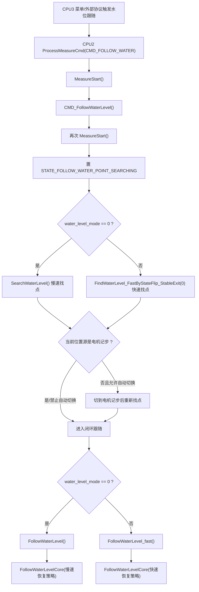

# 水位跟随功能测量流程梳理

本文基于当前工作区代码梳理 CPU2 水位跟随功能的测量流程，覆盖命令入口、参数和状态、跟随前找点、闭环步进、稳定监测、水位值更新、异常恢复和水位标定关联逻辑。

> 输入边界更新（2026-07-18）：本文“流程梳理已闭环”只表示水位跟随控制链已完成梳理，不代表 DSM 输入值正确性已闭环。DSM `Read_Water_Capacitance()` 当前会把合法的 `<30.0 pF` 改写为 `99999.9 pF`，该值可进入零点保存和下述状态判断；整改与台架条件见 [DSM 传感器协议适配复查](../未处理/2026-07-18_DSM传感器协议适配复查.md)。

## 1. 范围和相关代码

### 1.1 CPU3 操作入口

- 菜单显示和操作项：`LTD_DISPLAY_CPU3/Application/display/display_tankopera.c`
  - `COM_NUM_FOLLOW_WATER` 显示为“水位跟随 / Water Follow”。
  - `cmd_nopara_process()` 将 `COM_NUM_FOLLOW_WATER` 映射为 `CMD_FOLLOW_WATER`。
- 外部 DSM/Modbus 映射：`LTD_DISPLAY_CPU3/Communication/external/DSM_modbus/DSM_SlaveModbus_modbus2.c`
  - `COM_WATER_FOLLOW` 映射为 `CMD_FOLLOW_WATER`。

### 1.2 CPU2 测量入口和实现

- 命令分发：`LTD_MAIN_CPU2/Application/Src/measure.c`
  - `ProcessMeasureCmd()` 收到 `CMD_FOLLOW_WATER` 后调用 `CMD_FollowWaterLevel()`。
  - `CMD_FollowWaterLevel()` 是 CPU2 水位跟随命令主入口。
- 水位测量和跟随：`LTD_MAIN_CPU2/Application/Src/measure_waterLevel.c`
  - `SearchWaterLevel()`：慢速粗找 + 精找水位。
  - `FindWaterLevel_FastByStateFlip_StableExit()`：快速状态翻转找跟随点。
  - `FollowWaterLevelCore()`：闭环步进跟随核心。
  - `MonitorWaterFollowChange()`：稳定后的水位变化监测。
  - `CMD_CalibrateWaterLevel()`：水位标定及标定后恢复跟随。
- 水位接口声明：`LTD_MAIN_CPU2/Application/Inc/measure_water_level.h`
- 命令、状态和设备参数定义：`LTD_MAIN_CPU2/Services/ParamStorage/system_parameter.h`

## 2. 命令、状态和参数

### 2.1 命令和状态

- `CMD_FOLLOW_WATER = 8`：水位跟随命令。
- `STATE_FOLLOW_WATER_POINT_SEARCHING = 0x0024`：寻找水位跟随点中。
- `STATE_FOLLOW_WATERING = 0x8024`：水位跟随中。当前实现把长期跟随态放在 `0x80xx` 完成态区间。
- `STATE_FINDWATER = 0x001F` / `STATE_FINDWATER_OVER = 0x801F`：单次寻找水位。
- `STATE_CALIBRATE_WATERING = 0x0030` / `STATE_CALIBRATE_WATER_OVER = 0x8030`：水位标定。

### 2.2 主要参数和单位

水位跟随以水位电容为闭环判断依据。设备参数里的电容阈值按整数存储，代码通过 `WaterCapRawToFloat(raw)` 转为实际电容值：

```c
return raw / 1000.0f;
```

主要参数如下：

| 参数 | 单位/倍率 | 当前用途 |
| --- | --- | --- |
| `water_tank_height` | `0.1mm` | 水位罐高，计算水位高度的基准。 |
| `water_level_mode` | 枚举 | `0` 使用慢速粗找 + 精找；非 `0` 使用快速状态翻转找点。 |
| `water_cap_threshold` | `x1000` | 水位目标电容增量，目标电容为 `zero_capacitance + water_cap_threshold/1000`。 |
| `water_find_cap_threshold` | `x1000` | 闭环跟随稳定带半宽。 |
| `water_lag_cap_threshold` | `x1000` | 稳定监测阶段判断水位变化的电容偏差阈值。 |
| `water_stable_threshold` | `0.1mm` | 快速翻转找点时，水位估计值的稳定窗口波动阈值。 |
| `zero_cap` | 参数值除以 `10.0` | 当运行时 `zero_capacitance` 为空且参数不为 0 时，用作零点电容。 |
| `position_source_auto_switch` | 枚举 | 跟随前是否允许从编码轮记步自动切到电机记步。 |
| `calibrateWaterLevel` | `0.1mm` | 水位标定真值，用于反推 `water_tank_height`。 |

### 2.3 关键常量

| 常量 | 当前值 | 含义 |
| --- | --- | --- |
| `WATER_FOLLOW_SAMPLE_MS` | `500ms` | 闭环和稳定监测采样周期。 |
| `WATER_FOLLOW_STEP_SMALL_MM` | `0.2mm` | 小偏差步长。 |
| `WATER_FOLLOW_STEP_MED_MM` | `3.0mm` | 中偏差步长。 |
| `WATER_FOLLOW_STEP_BIG_MM` | `10.0mm` | 大偏差步长。 |
| `WATER_FOLLOW_STABLE_MONITOR_COUNT` | `5` | 连续 5 次稳定后进入稳定监测，约 `2.5s`。 |
| `WATER_FOLLOW_ENTER_TIMEOUT_MS` | `180000ms` | 连续调节 180s 未进入稳定区时，强制进入稳定监测。 |
| `WATER_ROUGH_RETRY_MAX` | `3` | 慢速粗找最大重试次数。 |
| `WATER_PRECISE_RETRY_MAX` | `3` | 慢速精找最大重试次数。 |
| `WATER_ROUGH_CONFIRM_DELAY_MS` | `3000ms` | 粗找停机后复判等待时间。 |
| `WATER_INIT_UP_MM` | `100mm` | 初始/精找前上行避让距离。 |
| `WATER_FAIL_RECOVER_UP_MM` | `100mm` | 粗找复判失败后的上行回退距离。 |
| `WATER_STABLE_WINDOW_DEFAULT_MS` | `30000ms` | 快速模式丢失恢复时的稳定判定窗口。 |

注意：`measure_waterLevel.c` 里还定义了 `WATER_FOLLOW_LOST_COUNT_MAX = 20`，但当前闭环实际触发重新找水位的条件是硬编码 `lost_count >= 5`，该常量未参与判断。

## 3. 水位值和电容状态的基础计算

### 3.1 水位状态判定

`check_water_status()` 每次读取 `Sensor_ReadWaterCapacitance(&cap)`，再用零点电容和水位电容阈值判定当前探头在空气区还是水区：

```text
zero = g_measurement.water_measurement.zero_capacitance
th   = zero + water_cap_threshold / 1000.0

cap > th   -> WATER
cap <= th  -> NORMAL
```

判定后会同步更新：

```text
g_measurement.water_measurement.current_capacitance = cap
```

### 3.2 水位高度计算

当前水位高度使用 `WaterLevelCalcFromCable()` 计算：

```text
water_level = water_tank_height - cable_length
```

实现中先用 `int64_t` 计算，再钳位到 `int32_t`，避免 `water_tank_height` 与负缆长或异常缆长混算成无符号大数。

对外上报通过 `WaterLevelSetAndLog()` 写入：

```text
g_measurement.water_measurement.water_level
```

如果计算水位为负值，内部缓存 `water_value` 仍保存有符号结果，但对外 `water_level` 按 `0` 上报。

## 4. 总体流程



当前入口上有一个实现细节：`ProcessMeasureCmd()` 在进入 `switch` 前已经调用一次 `MeasureStart()`，而 `CMD_FollowWaterLevel()` 内部又调用一次 `MeasureStart()`。因此当前水位跟随命令实际会做两次测量初始化。本文按当前代码记录，不在此文档中修改该行为。

## 5. 跟随前找点

跟随前一定先找一次水位点，目的是让后续闭环在水位附近启动。当前按 `water_level_mode` 分为两套找点逻辑。

### 5.1 慢速找水：`SearchWaterLevel()`

慢速模式用于 `water_level_mode == 0`。它由零点准备、初始避让、粗找、精找和最终记录组成。

#### 5.1.1 零点准备

1. 先调用 `fault_info_init()`，打印“水位测量 开始”。
2. 如果 `zero_point_status == 1` 且 `error_auto_back_zero == 1`，先执行 `SearchZero()`。
3. 如果 `g_measurement.water_measurement.zero_capacitance == 0`：
   - `zero_cap == 0`：执行 `SearchZero()` 获取零点电容。
   - `zero_cap != 0`：使用 `zero_cap / 10.0` 作为 `zero_capacitance`。
4. 打印零点电容、水位电容阈值和水位寻找电容阈值。

#### 5.1.2 初始避让

1. 如果 `debug_data.cable_length > 2000`，先上行 `100mm`。
2. 读取当前水位状态。
3. 如果当前已经在水区，则每次上行 `100mm`，直到 `check_water_status()` 返回 `NORMAL`。
4. 如果上行过程中 `sensor_position <= 1000` 仍在水区，认为零点附近仍未提出水面，返回 `MEASUREMENT_WATERLEVEL_LOW`。

#### 5.1.3 粗找阶段

粗找最多重试 `3` 次。

单次粗找流程：

1. `MotorCtrl_LostStepInit()` 重置丢步检测。
2. 循环调用 `MotorCtrl_MoveDown()` 下行。
3. 每轮读取 `check_water_status()`：
   - 仍为 `NORMAL`：继续下行并调用 `MotorCtrl_CheckLostStepAutoTiming()`。
   - 变为 `WATER`：跳出循环。
4. 调用 `MotorCtrl_SlowStop()` 停机。
5. 等待 `3000ms`，再复判一次水位状态。
6. 复判仍为 `WATER`：
   - 用 `WaterLevelCalcFromCable()` 更新临时 `water_value`。
   - 粗找成功。
7. 复判不是 `WATER`：
   - 上行 `100mm`。
   - 返回 `MEASUREMENT_WATERLEVEL_LOW`，由外层决定是否重试。

粗找失败会按 `ErrorLog_Retry()` 打印“粗找水位”重试日志；重试后成功会打印 `ErrorLog_Recover()`。

#### 5.1.4 精找阶段

精找最多重试 `3` 次。

单次精找流程：

1. 如果 `sensor_position > 2000`，先上行 `100mm`。
2. 重置丢步检测。
3. 循环下行找水，速度按接近粗找水位的程度降速：

```text
if WaterLevelCalcFromCable() - water_value < 100:
    speed_x100 = 4
else if WaterLevelCalcFromCable() - water_value < 1000:
    speed_x100 = 40
else:
    speed_x100 = MotorCtrl_GetDefaultSpeedX100()
```

4. 每轮调用 `check_water_status()`：
   - `NORMAL`：继续下行并做丢步检测。
   - `WATER`：停止。
5. `MotorCtrl_SlowStop()` 后，用 `WaterLevelCalcFromCable()` 更新临时 `water_value`。

精找失败同样会按 `ErrorLog_Retry()` 打印“精找水位”重试日志；重试后成功会打印 `ErrorLog_Recover()`。

#### 5.1.5 最终记录

粗找和精找都成功后，`SearchWaterLevel()` 调用：

```text
WaterLevelSyncFromCable()
```

它会把 `water_tank_height - cable_length` 写入 `g_measurement.water_measurement.water_level`，负值按 `0` 上报。

### 5.2 快速状态翻转找点：`FindWaterLevel_FastByStateFlip_StableExit()`

快速模式用于 `water_level_mode != 0`。它不是长期跟随主循环，只负责给闭环跟随找一个初始水位点。

入口有两个典型调用方式：

- 跟随启动时传入 `stable_win_ms = 0`：形成可用跟随点后立即退出。
- 丢失恢复时传入 `WATER_STABLE_WINDOW_DEFAULT_MS = 30000`：要求 30 秒稳定窗口后再退出。

流程如下：

1. 确认 `zero_capacitance`。如果为空，则按 `zero_cap` 或 `SearchZero()` 获取。
2. 读取当前状态：
   - 当前为 `WATER`：连续上行，直到状态翻转为 `NORMAL`。
   - 当前为 `NORMAL`：连续下行，直到状态翻转为 `WATER`。
3. 如果上行找空气时 `cable_length <= 1000` 仍在水区，返回 `MEASUREMENT_WATERLEVEL_LOW`。
4. 每次发生 `WATER/NORMAL` 翻转，记录一次翻转水位：

```text
lvl_flip = water_tank_height - cable_length
```

5. 第一次翻转只缓存 `last_flip_lvl`，不更新对外水位。
6. 第二次及以后，用最近两次翻转水位做无偏平均：

```text
lvl_avg = average(last_flip_lvl, lvl_flip)
```

7. 调用 `WaterLevelSetAndLog(lvl_avg)` 更新对外水位。
8. 用 `min_level` / `max_level` 统计稳定窗口内的水位估计波动：
   - 如果 `max_level - min_level > water_stable_threshold`，重置稳定窗口。
   - 否则等待 `stable_win_ms` 时间达到。
9. 稳定满足后：
   - `MotorCtrl_SlowStop()`。
   - 调用 `AlignToWaterLevel_01mm(lvl_avg)` 运行到平均水位对应的缆长附近。
   - 返回 `NO_ERROR`。

`stable_win_ms = 0` 时，第二次翻转后 `elapsed >= 0` 立即成立，因此启动阶段通常第二次翻转后就会停机、对齐并进入闭环。

### 5.3 跟随前位置源切换

初始找点完成后，`CMD_FollowWaterLevel()` 检查当前位置源：

1. 如果已经是电机记步，直接进入闭环。
2. 如果不是电机记步，调用 `EnsureMotorPositionSourceBeforeFollow("水位跟随", &switched_to_motor)`。
3. 如果 `position_source_auto_switch` 禁止自动切换，则保留原位置源继续跟随。
4. 如果允许自动切换，则从编码轮记步切到电机记步。
5. 只要实际发生切换，就重新找一次水位点：
   - 慢速模式重新 `SearchWaterLevel()`。
   - 快速模式重新 `FindWaterLevel_FastByStateFlip_StableExit(0)`。

这个重新找点步骤很关键：切换位置源后不沿用切换前的液面位置，避免后续闭环基准错位。

## 6. 闭环步进跟随

慢速模式和快速模式最终都进入 `FollowWaterLevelCore()`，差异只在丢失后的恢复策略：

- `FollowWaterLevel()`：恢复时调用 `SearchWaterLevel()`。
- `FollowWaterLevel_fast()`：恢复时调用 `FindWaterLevel_FastByStateFlip_StableExit(30000)`。

### 6.1 阈值计算

闭环开始时只计算一次本轮阈值：

```text
air_cap     = zero_capacitance
target_cap  = air_cap + water_cap_threshold / 1000.0
follow_band = water_find_cap_threshold / 1000.0

th_low = target_cap - follow_band
th     = target_cap + follow_band
```

判断规则：

```text
cap >= th       -> 偏水，上行
cap <= th_low   -> 偏空气，下行
th_low < cap < th -> 稳定区，不动作
```

### 6.2 单轮闭环动作

闭环循环每轮执行：

1. 读取 `Sensor_ReadWaterCapacitance(&cap)`。
2. 保存 `current_capacitance`。
3. 根据 `cap` 与 `th/th_low` 判断偏水、偏空气或稳定区。
4. 偏水/偏空气时按偏差选择步长。
5. 调用 `MotorCtrl_MoveAndWait(step_mm, dir, MotorCtrl_GetDefaultSpeedX100())` 阻塞移动。
6. 移动完成后打印位置和当前上报水位。
7. 延时 `500ms`。
8. 检查命令切换。

因此当前水位跟随是“读电容 -> 判断方向 -> 走一步 -> 等完成 -> 再读电容”的阻塞式步进闭环，不是连续速度伺服。

### 6.3 步长选择

偏水时：

```text
diff = cap - th
dir  = MOTOR_DIRECTION_UP
```

偏空气时：

```text
diff = th_low - cap
dir  = MOTOR_DIRECTION_DOWN
```

步长分档：

```text
if diff > 0.6 * (water_cap_threshold / 1000.0):
    step_mm = 10.0
else if diff > 0.1 * (water_cap_threshold / 1000.0):
    step_mm = 3.0
else:
    step_mm = 0.2
```

### 6.4 稳定区处理

当电容进入 `(th_low, th)`：

1. 清零大偏差丢失计数。
2. `stable_count++`。
3. 电机不动作。
4. 只打印当前 `water_level`，不在稳定区内刷新水位。
5. 连续稳定 `5` 次后进入 `MonitorWaterFollowChange(target_cap)`。

采样周期为 `500ms`，所以连续 5 次稳定约等于 `2.5s`。

### 6.5 连续调节超时兜底

如果闭环一直在偏水/偏空气调节，超过 `180000ms` 仍未进入稳定区，代码会强制进入 `MonitorWaterFollowChange(target_cap)`。

这表示系统进入长期监测状态，但现场仍可能存在电容目标带设置不合理、探头响应异常、液面变化过快或机械移动效果不足等问题，需要结合日志里的电容、方向、步长和位置变化判断。

## 7. 稳定监测

`MonitorWaterFollowChange(target_cap)` 是稳定后的长期监测循环。

进入监测时：

1. 设置 `g_measurement.device_status.device_state = STATE_FOLLOW_WATERING`。
2. 打印“进入稳定监测，置为水位跟随状态”。
3. 调用一次 `WaterLevelSyncFromCable()`，把当前缆长对应的水位写入对外 `water_level`。

监测循环中：

1. 每 `500ms` 读取一次水位电容。
2. 更新 `current_capacitance`。
3. 计算：

```text
diff = abs(cap - target_cap)
monitor_diff = water_lag_cap_threshold / 1000.0
```

4. 如果 `diff > monitor_diff`，认为水位变化已经超过滞后阈值，退出监测并返回闭环步进。
5. 如果 `diff <= monitor_diff`，电机保持不动，只打印进入监测时锁定的 `water_level`。

稳定监测阶段不会持续用缆长刷新水位值，只有进入监测时刷新一次。

## 8. 丢失判断和恢复

每次步进移动完成后，闭环做一次“大偏差”判断：

```text
th_span = water_cap_threshold / 1000.0

if diff > 0.6 * th_span:
    lost_count++
else:
    lost_count = 0
```

代码会计算并打印 `cap_delta = abs(cap - last_cap)`，注释里也写到“大偏差 + 电容几乎不变”，但当前实际判断只使用 `diff > 0.6 * th_span`，`cap_delta` 没有参与触发条件。

当前实际恢复触发条件：

```text
lost_count >= 5
```

触发后：

1. 打印“长时间大偏差，重新找水位”。
2. 按当前模式执行恢复找点：
   - 慢速模式：`SearchWaterLevel()`。
   - 快速模式：`FindWaterLevel_FastByStateFlip_StableExit(30000)`。
3. 成功后清零 `lost_count`。
4. 回到闭环继续跟随。

## 9. 水位值更新时机

对外水位值：

```text
g_measurement.water_measurement.water_level
```

当前会更新水位值的时机：

1. 慢速 `SearchWaterLevel()` 粗找 + 精找成功后的最终记录阶段。
2. 快速 `FindWaterLevel_FastByStateFlip_StableExit()` 第二次及以后状态翻转后，用最近两次翻转水位平均值更新。
3. `MonitorWaterFollowChange()` 入口，进入稳定监测时同步一次当前缆长对应的水位。
4. `CorrectWaterTankHeightProcess()` 水位标定修正罐高后同步一次。

当前不会更新水位值的时机：

- 闭环每次步进移动完成后不更新。代码中的 `UpdateWaterLevelIfValid()` 调用已注释。
- 闭环稳定区内不更新。代码中的 `WaterLevelSyncFromCable()` 调用已注释。
- 稳定监测循环内部不更新，只打印进入监测时锁定的值。

因此长期水位跟随运行时，`water_level` 更像“最近一次找点、进入稳定监测或标定后的水位快照”，不是每次闭环步进后的实时水位。

## 10. 水位标定和跟随的关系

`CMD_CalibrateWaterLevel()` 用当前缆长和用户输入的标定真值反推 `water_tank_height`：

```text
new_water_tank_height = current_cable_length + calibrateWaterLevel
```

当前实现不再追加固定 `+1` 偏置，标定真值按 `0.1mm` 单位直接反推罐高。

流程：

1. 调用 `MeasureStart()`。
2. 判断进入标定前是否处于 `STATE_FOLLOW_WATERING`，保存为 `resume_follow`。
3. 如果 `calibrateWaterLevel == 0`，报 `PARAM_ERROR`。
4. 置状态为 `STATE_CALIBRATE_WATERING`。
5. 如果原本不在跟随态，先调用 `SearchWaterLevel()` 找到水位。
6. 调用 `CorrectWaterTankHeightProcess()`：
   - 计算新 `water_tank_height`。
   - 合法性检查：`0 < new_height <= 5000000`。
   - 写入 `g_deviceParams.water_tank_height`。
   - `WaterLevelSyncFromCable()` 同步一次水位。
   - 清零 `calibrateWaterLevel`。
   - `save_device_params()` 保存参数。
7. 如果原本在跟随态，标定完成后重新进入 `FollowWaterLevel()` 或 `FollowWaterLevel_fast()`。
8. 如果原本不在跟随态，置 `STATE_CALIBRATE_WATER_OVER`。

## 11. 命令切换和错误出口

水位测量和跟随流程里多处调用：

- `CHECK_COMMAND_SWITCH()`：检测新命令或取消当前命令，返回 `STATE_SWITCH`。
- `CHECK_ERROR()` / `SET_ERROR()`：把底层错误交给统一错误处理。
- `RETURN_ERROR()`：在测量函数内部记录并返回错误。

慢速粗找和精找对普通搜索失败做重试日志：

- 粗找：`ERROR_LOG_OP_SEARCH_WATER_ROUGH`，最多 3 次。
- 精找：`ERROR_LOG_OP_SEARCH_WATER_PRECISE`，最多 3 次。

命令切换被视为正常打断，慢速粗找/精找中遇到 `STATE_SWITCH` 会直接向上透传，不参与故障重试。

## 12. 参数示例

如果现场参数为：

```text
water_cap_threshold      = 7000
water_find_cap_threshold = 200
water_lag_cap_threshold  = 300
```

则实际电容参数为：

```text
A = 7.0
B = 0.2
L = 0.3
```

设零点电容为 `Z`：

```text
target_cap = Z + 7.0
th_low     = Z + 6.8
th         = Z + 7.2
```

闭环判断：

- `cap >= Z + 7.2`：偏水，上行。
- `cap <= Z + 6.8`：偏空气，下行。
- `Z + 6.8 < cap < Z + 7.2`：稳定区，不动作。

步长：

- 偏差 `> 4.2`：走 `10.0mm`。
- 偏差 `> 0.7`：走 `3.0mm`。
- 偏差 `<= 0.7`：走 `0.2mm`。

稳定监测：

- `abs(cap - (Z + 7.0)) <= 0.3`：继续监测，不动电机。
- `abs(cap - (Z + 7.0)) > 0.3`：返回闭环步进。

这个参数组合下，稳定监测带宽 `0.3` 大于闭环寻找带宽 `0.2`。因此存在 `Z+6.7 ~ Z+6.8` 和 `Z+7.2 ~ Z+7.3` 两段区域：稳定监测认为仍可保持，但闭环若运行到这些区域已经会触发下行或上行。现场表现可能是进入稳定监测后小幅水位变化响应偏迟。

## 13. 当前实现要点和维护注意

1. 水位跟随命令进入闭环前一定先找点；如果切换到电机记步，会重新找点。
2. `ProcessMeasureCmd()` 和 `CMD_FollowWaterLevel()` 当前都会调用 `MeasureStart()`，水位跟随入口实际初始化两次。
3. 慢速模式用粗找 + 精找定位水位，快速模式用 WATER/NORMAL 状态翻转平均值定位水位。
4. 闭环是阻塞式步进调节，不是连续速度闭环。
5. 进入稳定区连续约 `2.5s` 后，才正式置 `STATE_FOLLOW_WATERING` 并进入稳定监测。
6. 稳定监测期间电机不动，只用电容偏离目标值是否超过 `water_lag_cap_threshold` 判断是否返回闭环。
7. 长期跟随中的 `water_level` 不是实时连续刷新值，主要在找点完成、快速翻转平均、进入稳定监测和水位标定后更新。
8. 丢失恢复实际按 `lost_count >= 5` 触发；`WATER_FOLLOW_LOST_COUNT_MAX = 20` 当前未使用。
9. 丢失判断当前只看“大偏差”，日志里的 `cap_delta` 没有参与判断。
10. 快速找点启动阶段传入 `stable_win_ms = 0`，第二次翻转后通常立即满足稳定窗口；丢失恢复才使用 `30000ms` 稳定窗口。
