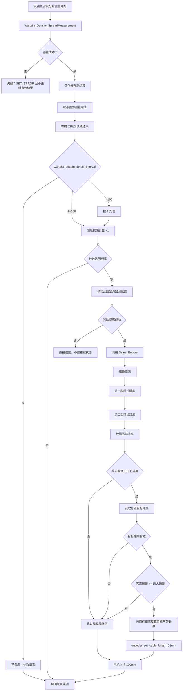

# 瓦锡兰分布测后探底编码器修正流程

> 当前复核（2026-07-08）：状态：已闭环（带差异说明）。当前 HEAD 已通过 `7433bbd6` 和 `f2af9745` 落地测后回固定点、按间隔探底、修正罐高参数和 `ApplyBottomEncoderCorrection()`；现行代码中固定点参数越界仍会上报 `PARAM_RANGE_ERROR`，其他回固定点或探底失败会退回 `CMD_MONITOR_SINGLE`，该差异作为后续风险说明保留。

## 1. 目的

本文档整理瓦锡兰密度分布测量完成后的新流程需求：先回到固定点监测位置，再执行测后探底，并在满足偏差条件时使用新增的修正罐高参数矫正编码器值。

本流程的目标是避免继续使用可能不准确的液位罐高 `tankHeight` 作为编码器修正参考，同时降低瓦锡兰分布测后探底对错误状态和密度读取流程的影响。

## 2. 新需求汇总

1. 新增一个罐高参数，用于替换液位罐高修正编码值。
2. 瓦锡兰分布测完成后，先运行到固定点监测位置；此步骤只移动，不读取密度。移动过程中如果报错，直接退出本次瓦锡兰后续流程，不置错误状态。
3. 罐底测量完成后，如果本次罐底测量实高偏差大于实高最大偏差，则不执行编码器修正。

## 3. 涉及文件

- `LTD_MAIN_CPU2/Application/Src/measure.c`
  - `CMD_WartsilaDensitySpread()`：瓦锡兰密度分布测量入口，负责测后等待、回固定点监测位置、按频率触发探底。
- `LTD_MAIN_CPU2/Application/Src/measure_tank_height.c`
  - `SearchBottom()`：通用罐底测量流程。
  - `ApplyBottomEncoderCorrection()`：罐底测量完成后的编码器矫正。
  - `BuildBottomCableLengthFromTankHeight()`：根据目标罐高反算探头在罐底时的目标尺带长度。
- `LTD_MAIN_CPU2/Services/ParamStorage/system_parameter.h/.c`
  - 新增修正罐高参数、默认值、合法性检查和参数打印。
- `LTD_MAIN_CPU2/Services/Modbus/stateformodbus.h`
  - 新增或确认修正罐高参数的保持寄存器映射。
- `LTD_DISPLAY_CPU3/Application/system_param/*`
  - 同步新增 CPU3 参数结构、参数表、内部 Modbus 读写和参数同步。
- `LTD_DISPLAY_CPU3/Application/display/*`
  - 如需要屏幕配置该参数，新增菜单项和字库检查。

## 4. 新增修正罐高参数

建议新增参数：

```c
g_deviceParams.bottom_encoder_correction_tank_height
```

建议中文名：

- `探底修正罐高`
- 或 `编码修正罐高`

单位建议沿用现有罐高参数：`0.1 mm`。

默认值建议为 `0`：

- `0`：兼容旧逻辑，仍使用 `g_deviceParams.tankHeight` 作为编码器修正目标罐高。
- 非 `0`：使用新增修正罐高参数作为编码器修正目标罐高。

目标罐高选择逻辑建议集中封装：

```c
static uint32_t GetBottomEncoderCorrectionTankHeight(void)
{
    if (g_deviceParams.bottom_encoder_correction_tank_height != 0U) {
        return g_deviceParams.bottom_encoder_correction_tank_height;
    }

    return g_deviceParams.tankHeight;
}
```

这样旧参数未配置时不会改变现场旧行为；配置新参数后，编码器修正不再依赖液位罐高。

## 5. 瓦锡兰分布测主流程

入口函数为 `CMD_WartsilaDensitySpread()`。

当前实现流程如下：

1. 设置设备状态为 `STATE_WARTSILA_DENSITY_MEASURING`。
2. 调用 `Wartsila_Density_SpreadMeasurement(&temp)` 执行瓦锡兰密度分布测量。
3. 如果返回 `STATE_SWITCH`，按命令切换正常退出。
4. 如果返回错误码，打印失败日志并调用 `SET_ERROR(ret)`，不把临时结果写入 `g_measurement.density_distribution`，并结束本次命令，不进入成功完成态和测后探底流程。
5. 只有返回 `NO_ERROR` 时，才将本次分布测结果写入 `g_measurement.density_distribution`，并刷新完成锁存和完成计数。
6. 延时 1 秒，期间允许命令切换打断。
7. 打印分布测量结果。
8. 设置设备状态为 `STATE_WARTSILA_DENSITY_OVER`。
9. 延时 8 秒，给 CPU3 读取分布测量结果，期间允许命令切换打断。
10. 判断 `g_deviceParams.wartsila_bottom_detect_interval`，确定本次是否需要测后探底。
11. 如果本次不需要探底，切回 `CMD_MONITOR_SINGLE`。
12. 如果本次需要探底，先移动到固定点监测位置。
13. 固定点移动完成后，调用 `SearchBottom()` 执行罐底测量。
14. 罐底测量完成且偏差合格时，执行编码器修正。
15. 流程结束后切回 `CMD_MONITOR_SINGLE`，继续单点监测。

## 6. 测后探底频率逻辑

瓦锡兰测后是否探底由参数 `g_deviceParams.wartsila_bottom_detect_interval` 控制。

| 参数值 | 当前行为 |
| --- | --- |
| `0` | 不执行测后探底，并清零运行期计数 |
| `1~100` | 每 N 次瓦锡兰分布测后执行一次探底 |
| `>100` | 强制按 `1` 处理，即每次分布测后都探底 |

内部使用 `static uint32_t bottom_detect_count` 作为运行期计数。该计数不持久化，设备重启后重新从 0 开始。

达到探底频率后，不应立即探底，而是先执行“移动到固定点监测位置”。

## 7. 测后先回固定点监测位置

新增要求：瓦锡兰分布测后，如果本次达到探底频率，先运行到固定点监测位置，再执行探底。

该步骤只做电机移动，不读取密度，不更新单点监测密度结果。

建议实现边界：

1. 目标位置使用“固定点监测位置”参数。
2. 如果当前位置已经在目标位置附近，可直接进入探底。
3. 移动过程应允许命令切换打断。
4. 移动过程中如果返回错误，直接退出 `CMD_WartsilaDensitySpread()` 后续流程。
5. 该移动错误不调用 `SET_ERROR(ret)`，不置 `g_measurement.device_status.error_code`，也不切换为错误状态。
6. 可打印普通提示日志，说明“瓦锡兰测后回固定点失败，跳过探底”，但不要走 `ErrorLog_*` 错误链路。

注意：当前参数命名需要在实现时核对。CPU3 侧已有 `singlePointMonitoringPosition` 语义；CPU2 侧当前参数映射里主要可见 `singlePointMeasurementPosition`。实现前应确认 CPU2 是否需要补齐“单点监测位置”字段和寄存器同步，避免误用单点测量位置。

## 8. SearchBottom 罐底测量流程

`SearchBottom()` 执行完整罐底搜索，主要步骤如下：

1. 清除故障信息，打印“罐底测量开始”。
2. 如果设备需要回零且允许自动回零，则先执行 `SearchZero()`。
3. 如果当前尺带长度大于 2000，即大于 200.0 mm，先上行 100 mm，避免起始位置过低。
4. 根据罐底检测模式准备陀螺仪零点参考。
5. 执行粗找罐底 `SearchBottomRough()`，最多重试 3 次。
6. 执行第一次精找罐底 `SearchBottomPrecise()`，最多重试 3 次。
7. 执行第二次精找罐底 `SearchBottomPrecise()`，最多重试 3 次。
8. 计算并记录本次罐底实高。
9. 判断实高偏差是否允许编码器修正。
10. 偏差合格时调用 `ApplyBottomEncoderCorrection()` 执行编码器修正。
11. 电机上行 100 mm，结束罐底测量流程。

如果任一步骤返回 `STATE_SWITCH`，表示命令切换打断，流程直接向上返回，不作为故障重试。

## 9. 罐底实高计算

罐底测量完成后，代码先确定本次罐底尺带长度：

```c
bottom_cable_length = (bottom_value > 0)
                    ? (uint32_t)bottom_value
                    : g_measurement.debug_data.cable_length;
```

然后根据探头距差计算原始罐高：

```c
raw_real_height = bottom_cable_length + g_deviceParams.liquid_sensor_distance_diff;
```

再叠加实高标定偏移：

```c
corrected_real_height = raw_real_height
                      + (g_deviceParams.currentTankHeight - g_deviceParams.initialTankHeight);
```

最终写入：

```c
g_measurement.height_measurement.current_real_height = corrected_real_height;
```

这里的 `corrected_real_height` 是本次测得的当前实高结果，也是判断“罐底测量偏差是否超过实高最大偏差”的输入之一。

## 10. 实高偏差判断

新增要求：如果罐底测量偏差大于实高最大偏差，不执行编码器修正。

建议偏差比较对象：

```c
correction_tank_height = GetBottomEncoderCorrectionTankHeight();
measured_real_height = g_measurement.height_measurement.current_real_height;
deviation = abs(measured_real_height - correction_tank_height);
```

判断条件：

```c
if ((g_deviceParams.maxTankHeightDeviation != 0U) &&
    (deviation > g_deviceParams.maxTankHeightDeviation)) {
    skip encoder correction;
}
```

建议语义：

- `maxTankHeightDeviation == 0`：不启用偏差限制，兼容旧逻辑。
- `maxTankHeightDeviation != 0`：本次罐底实高与编码器修正目标罐高的偏差必须小于等于该阈值，才允许修正编码器。

偏差超限时建议只跳过编码器修正，不修改本次罐底测量结果。可打印普通提示日志，例如：

```text
罐底编码器修正跳过：实高偏差超限 | 测量实高=... | 目标罐高=... | 偏差=... | 最大允许=...
```

是否置错误状态建议保持“不置错误状态”，因为需求只要求“不执行编码修正”，不是要求判定本次探底失败。

## 11. 编码器矫正流程

编码器矫正函数为 `ApplyBottomEncoderCorrection()`。它在 `SearchBottom()` 完成实高记录后、电机上行前执行。

新逻辑建议如下：

1. 打印 `g_deviceParams.bottom_encoder_correction_enable`。
2. 如果 `bottom_encoder_correction_enable != BOTTOM_ENCODER_CORRECTION_ENABLE`，直接跳过。
3. 获取编码器修正目标罐高：
   - 新增修正罐高参数非 0 时，使用新增修正罐高。
   - 新增修正罐高参数为 0 时，回退使用液位罐高 `tankHeight`。
4. 如果目标罐高为 0，直接跳过，避免用无效罐高修正编码器。
5. 比较本次罐底测量实高与目标罐高的偏差。
6. 如果偏差大于 `maxTankHeightDeviation`，跳过编码器修正。
7. 读取修正前编码值 `g_encoder_count`。
8. 读取修正前尺带长度 `encoder_get_cable_length_01mm()`。
9. 使用目标罐高计算目标尺带长度。
10. 调用 `encoder_set_cable_length_01mm(target_cable_length)` 修正编码器值。
11. 打印原编码、新编码、原尺带、目标尺带、液位罐高、新增修正罐高、实际采用罐高和偏差。

目标尺带长度计算关系为：

```c
target_cable_length = correction_tank_height
                    - g_deviceParams.liquid_sensor_distance_diff;
```

代码中可继续通过 `BuildBottomCableLengthFromTankHeight(correction_tank_height)` 完成该计算，并处理小于 0 或超过 `uint32_t` 上限的边界。

## 12. 调整后的流程图



## 13. 后续实现注意事项

1. 新增修正罐高参数会影响 CPU2/CPU3 共享参数和内部 Modbus 映射，需要同步修改两端结构体、寄存器、参数表和菜单。
2. 如果新增保持寄存器或改变共享协议，需要同步提升 `DEVICE_PROTOCOL_VERSION`，并更新 `docs/01_协议与寄存器/CPU2_CPU3协议变更记录.md`。
3. 固定点监测位置的参数来源需要先确认。若 CPU2 当前缺少独立 `singlePointMonitoringPosition`，需要同步补齐 CPU2 参数、寄存器和 CPU3 同步逻辑。
4. 固定点移动步骤只移动，不读取密度；失败时直接退出，不调用 `SET_ERROR(ret)`，不走 `ErrorLog_*` 错误链路。
5. 编码器修正前必须先做偏差判断，偏差超限只跳过修正，不应把编码器改到目标尺带长度。
6. CPU3 菜单新增中文显示时，需要检查字库是否包含新增汉字。
7. 修改后需要验证默认修正罐高为 `0` 时旧行为不变。
8. 修改后需要验证非 `0` 修正罐高时，瓦锡兰分布测后探底的编码器目标尺带长度来自新参数，而不是液位罐高。
9. 修改后需要验证固定点移动失败时不会置错误状态，且不会继续探底。
10. 修改后需要验证罐底实高偏差大于 `maxTankHeightDeviation` 时不会执行编码器修正。
